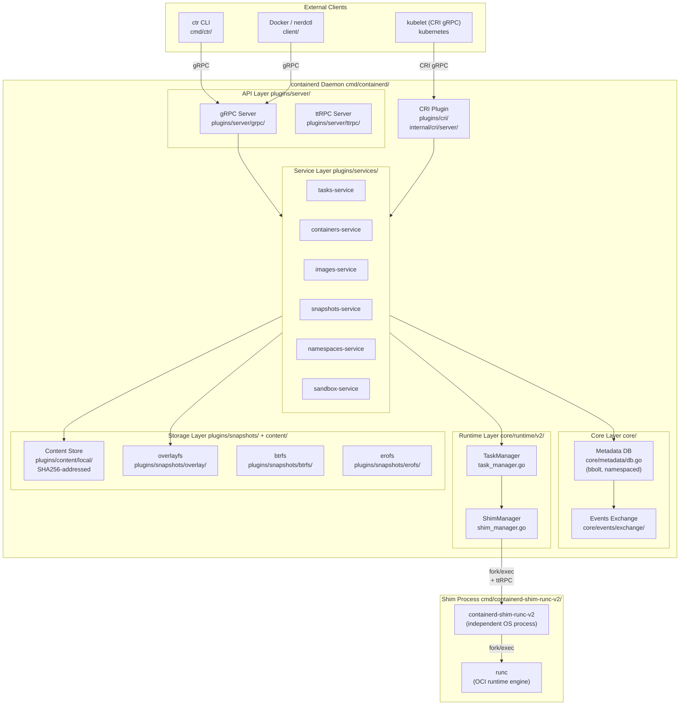
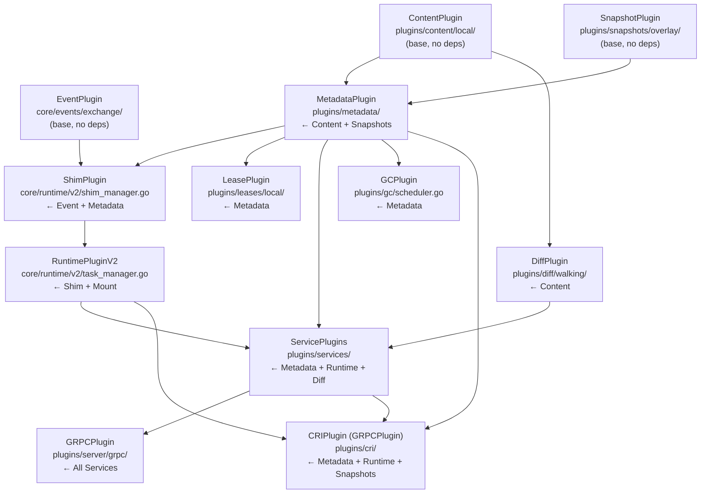
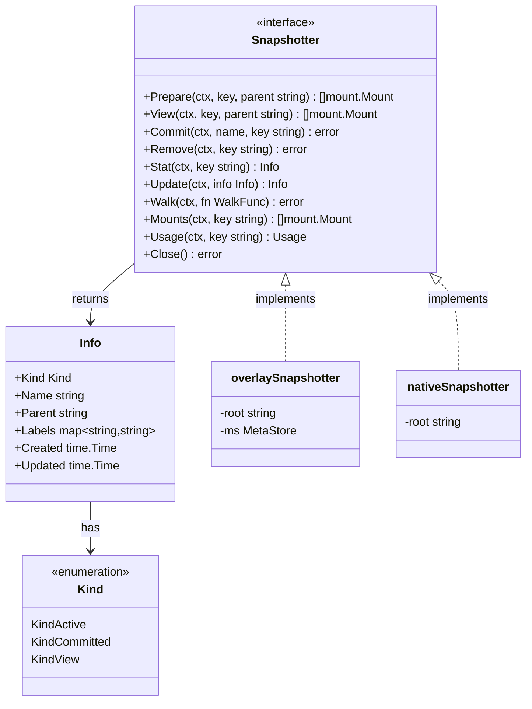
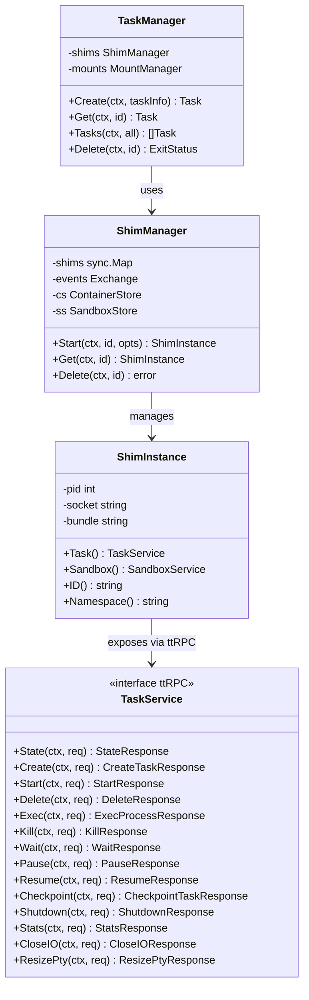
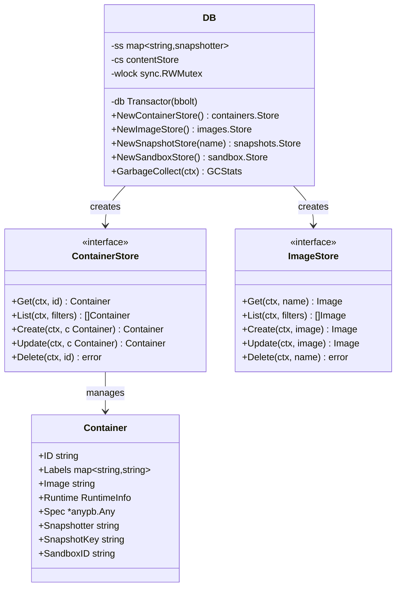
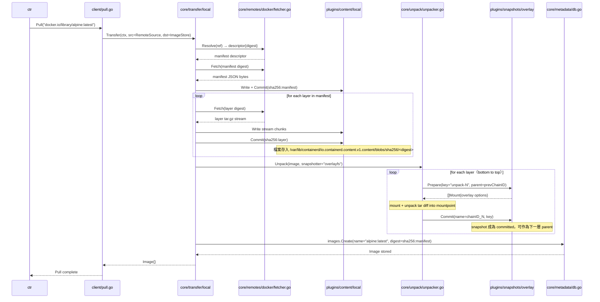
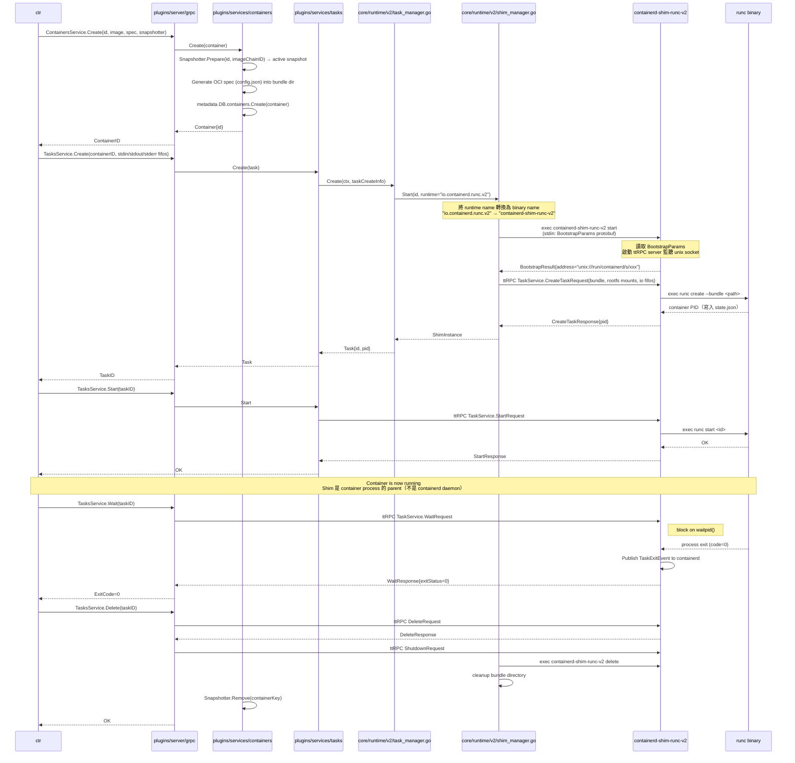
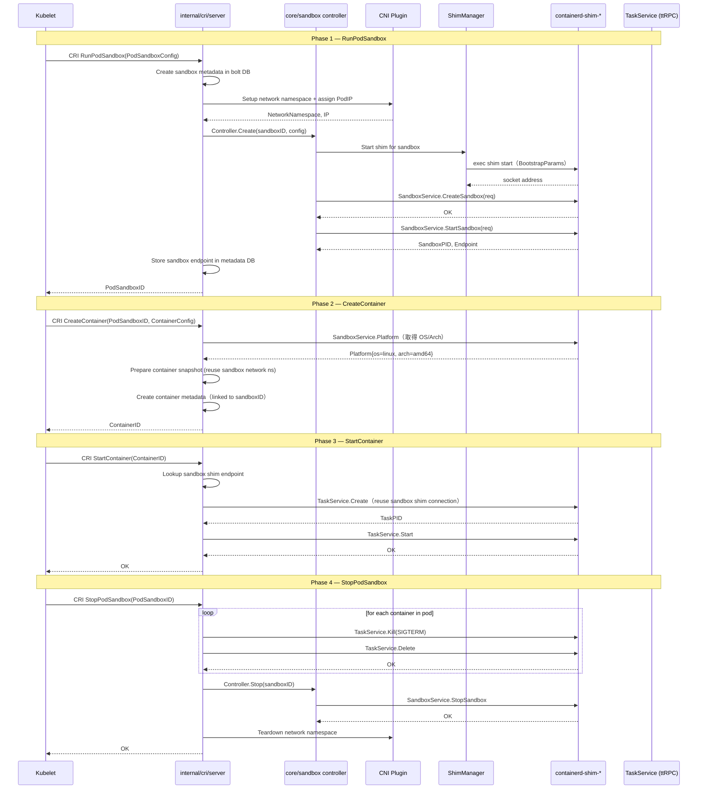
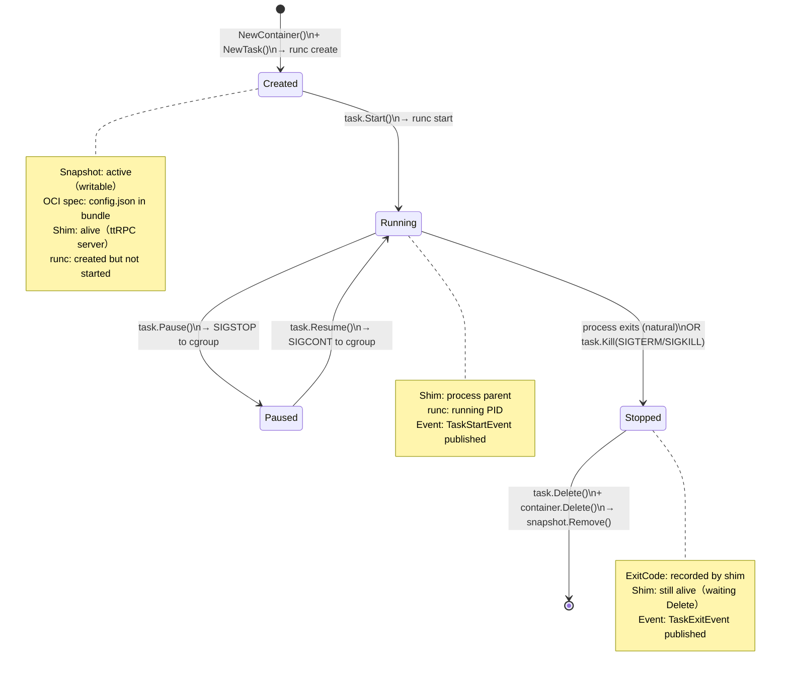
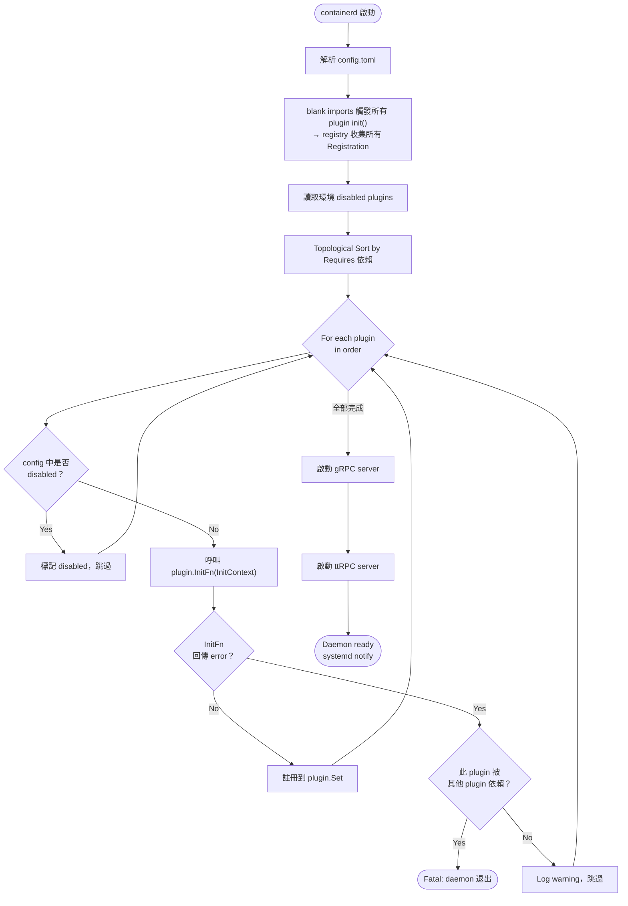

# containerd 架構解析報告

> Distributed Systems 期中報告 — 架構解析  
> NCCU CS, Chun-Feng Liao  
> 分析對象：containerd v2.x（CNCF Graduated）

---

## 目錄

1. [問題背景與設計動機](#1-問題背景與設計動機)
2. [靜態結構](#2-靜態結構)
   - 2.1 Component Diagram（整體）
   - 2.2 Plugin 依賴 Component Diagram
   - 2.3 Class Diagram：核心介面
3. [動態結構](#3-動態結構)
   - 3.1 Sequence：Image Pull
   - 3.2 Sequence：Container Run（ctr run）
   - 3.3 Sequence：Kubernetes Pod 建立（Sandbox API）
   - 3.4 Activity：Container 生命週期
   - 3.5 Activity：Plugin 初始化
4. [此設計如何解決問題](#4-此設計如何解決問題)

---

## 1. 問題背景與設計動機

### 舊架構的問題（Docker monolithic daemon）

Docker 最初是一個「all-in-one daemon」——所有功能（build、network、volume、runtime）耦合在同一個 process 裡。

```
問題列表：
1. Daemon 是容器的 parent process
   → daemon crash = 所有容器 SIGHUP，全部死亡

2. Storage 後端（graphdriver）與 image import/export 邏輯高度耦合
   → 想換 storage 後端需要改大量核心代碼

3. Runtime 硬編碼為 runc
   → 無法替換成 gVisor（沙箱）、Kata（VM-based）、WasmEdge（WASM）

4. 沒有標準化介面
   → Kubernetes 必須維護 dockershim 才能使用 Docker 作為 runtime
   → Kubernetes 1.24 起移除 dockershim

5. 多個系統（Docker + k8s）無法共用同一個底層 runtime
   → 各自管理資源，主機上有重複的 image 存放
```

### containerd 的回應

containerd 的設計目標是：**做最小的事，定義最清晰的介面，讓上層系統能安全嵌入。**

```
核心設計原則：

1. Shim 是容器的 parent（不是 daemon）  → 解決 daemon crash 問題
2. Snapshotter 介面分離 storage 與 image 邏輯 → 解決 storage 耦合問題
3. Runtime v2 ttRPC 介面抽象 runtime 實作   → 解決 runtime 鎖死問題
4. CRI plugin 提供標準 Kubernetes 介面       → 解決 k8s 整合問題
5. Namespace 多租戶 + Content-Addressed 共享 → 解決多系統共存問題
```

---

## 2. 靜態結構

### 2.1 整體 Component Diagram



---

### 2.2 Plugin 依賴 Component Diagram

> 展示 `registry.Register()` 宣告的 `Requires` 關係，決定初始化順序。



**初始化機制**：`cmd/containerd/builtins/builtins_linux.go` 用 blank import 觸發所有 `init()`，server 啟動時對 plugin registry 做 topological sort，依序呼叫 `InitFn`。

---

### 2.3 Class Diagram：核心介面

#### Snapshotter 介面（`core/snapshots/snapshotter.go`）



#### Runtime v2 介面（`api/runtime/task/v3/shim.proto`）



#### Metadata DB 與相關型別（`core/metadata/db.go`）



---

## 3. 動態結構

### 3.1 Sequence Diagram：Image Pull

> 呼叫路徑：`ctr pull` → `client/pull.go` → `core/transfer/local/pull.go` → registry → content store → snapshotter → metadata DB



---

### 3.2 Sequence Diagram：Container Run（ctr run）

> 完整路徑：`ctr run` → gRPC → `plugins/services/tasks` → `core/runtime/v2/task_manager.go` → `shim_manager.go` → `containerd-shim-runc-v2` → `runc`



---

### 3.3 Sequence Diagram：Kubernetes Pod 建立（Sandbox API）

> Kubelet → containerd CRI plugin → Sandbox API → Shim → Container



---

### 3.4 Activity Diagram：Container 生命週期



---

### 3.5 Activity Diagram：Plugin 初始化（Daemon 啟動）



**關鍵設計**：`InitFn` 透過 `ic.GetSingle(plugins.MetadataPlugin)` 取得依賴，runtime 注入，不是靜態 import。

---

## 4. 此設計如何解決問題

### 問題一：Daemon crash → 容器全死

**解法：Shim as Container Parent（`core/runtime/v2/shim_manager.go`）**

```
傳統 Docker：
  dockerd ──parent──→ container process
  dockerd crash → container SIGHUP

containerd：
  containerd ──fork/exec──→ containerd-shim-runc-v2
                                    │ parent
                                    ▼
                            runc ──fork──→ container process

  containerd crash：
    shim process 繼續存活（reparented to init by OS）
    container 繼續執行
    containerd restart → ShimManager.loadExistingShims()
                       → 重新連接既有的 shim unix socket
                       → 無縫恢復控制
```

**實作位置**：`core/runtime/v2/shim_manager.go` `Start()` + `shim_load.go` `loadExistingShims()`

**效果**：滿足 Availability NFR。Shim 的設計使 containerd 不是 SPOF（Single Point of Failure）。

---

### 問題二：Runtime 鎖死 runc

**解法：Runtime v2 ttRPC 介面抽象（`api/runtime/task/v3/shim.proto`）**

```
containerd 只認識 TaskService ttRPC 介面：
  Create / Start / Kill / Wait / Delete / Stats...

不同 shim binary 各自實作此介面：
  io.containerd.runc.v2  → containerd-shim-runc-v2 → runc（Linux containers）
  io.containerd.runhcs.v2→ containerd-shim-runhcs-v2→ hcsshim（Windows）
  io.containerd.kata.v2  → containerd-shim-kata-v2  → Kata（VM-based）
  io.containerd.wasm.v1  → containerd-shim-wasm-v1  → WasmEdge（WASM）

選擇 runtime 的方式（`core/runtime/v2/task_manager.go`）：
  runtime name "io.containerd.runc.v2"
      → 移除點 → "io-containerd-runc-v2"
      → 取最後兩段 → "runc-v2"
      → 加前綴 → "containerd-shim-runc-v2"
      → 在 $PATH 找 binary 執行
```

**效果**：新 runtime 只需實作 `TaskService` proto，不需修改 containerd 任何代碼。

---

### 問題三：Storage 後端（graphdriver）耦合 image 邏輯

**解法：Snapshotter 介面 + 職責分離**

```
舊 Docker graphdriver：
  image pull → graphdriver → 解包 tar → 管理 layer 關係 → 提供 rootfs
  （graphdriver 知道 image、layer、tar 格式）

containerd Snapshotter：
  只懂 Prepare / Commit / View / Remove
  不知道什麼是 image 或 container
  上層由 core/unpack/unpacker.go 負責解包 tar 並呼叫 Snapshotter

分工：
  core/remotes/docker/fetcher.go → 從 registry 拿 bytes
  plugins/content/local/store.go → 以 SHA256 存入磁碟
  core/unpack/unpacker.go        → 讀 content，解壓，呼叫 Snapshotter.Prepare/Commit
  plugins/snapshots/overlay/     → 只管 overlayfs lowerdir/upperdir

換 storage 後端只需替換 Snapshotter 實作，不改 fetcher 或 unpacker。
```

**實作位置**：`core/snapshots/snapshotter.go`（介面）、`plugins/snapshots/`（各後端）

---

### 問題四：多系統共存資源衝突

**解法：Namespace 多租戶 + Content-Addressed Storage**

```go
// pkg/namespaces/context.go
ctx := namespaces.WithNamespace(context.Background(), "k8s.io")
// 所有 API 呼叫都帶著 namespace，metadata DB 的 KV key 包含 namespace prefix

// core/metadata/db.go 的 bucket 結構：
// v1/<namespace>/containers/<id>  → container spec
// v1/<namespace>/images/<name>    → image ref → digest
// v1/<namespace>/snapshots/...    → namespace-isolated snapshot metadata
// v1/blobsizes/<digest>           → 所有 namespace 共享 content（以 digest 為 key）
```

**效果**：
- Docker（`moby` namespace）與 Kubernetes（`k8s.io` namespace）完全獨立
- `alpine:latest` image 在兩個 namespace 各有一個 name entry，但 content（layers）只存一份
- 符合 Multi-tenancy + Space Efficiency 兩個目標

---

### 問題五：Kubernetes Pod sandbox 無抽象（hardcoded pause container）

**解法：Sandbox API（`core/sandbox/controller.go`）**

```
舊實作：
  CRI plugin 直接 hardcode "pause container" 作為 sandbox
  → VM-based runtime（Kata）必須自己 fork 整個 CRI plugin 才能改 sandbox 實作

Sandbox API（v2.0 stable）：
  CRI plugin 呼叫 SandboxController.Create/Start/Stop
  Controller 是介面，有兩個實作：

  1. shim controller（core/runtime/v2/）
     → 呼叫 shim binary 的 SandboxService RPC
     → 適合 Kata（shim 本身管理 VM sandbox）

  2. podsandbox controller（internal/cri/server/podsandbox/）
     → 啟動 pause container 作為 sandbox
     → 適合一般 runc-based runtime
```

**效果**：Runtime 作者可以自訂 sandbox 實作，不需修改 CRI plugin 或 containerd 核心。

---

### 設計問題與解法對應表（簡報用）

| 設計問題 | 根本原因 | containerd 解法 | 關鍵程式碼位置 |
|---------|---------|----------------|--------------|
| Daemon crash → 容器死 | Daemon 是 container parent | Shim 作為獨立 process parent | `core/runtime/v2/shim_manager.go` |
| Runtime 鎖死 runc | 硬編碼 runc 呼叫 | ttRPC TaskService 介面抽象 | `api/runtime/task/v3/shim.proto` |
| Storage 耦合 image 邏輯 | graphdriver 知道太多 | Snapshotter 介面：只管快照 | `core/snapshots/snapshotter.go` |
| 多系統資源衝突 | 沒有隔離層 | Namespace + Content-Addressed | `core/metadata/db.go` |
| k8s Pod sandbox 無法替換 | pause container hardcoded | Sandbox Controller 介面 | `core/sandbox/controller.go` |
| Runtime 啟動順序難管理 | 靜態依賴 | Plugin registry + topo sort | `cmd/containerd/server/server.go` |

---

*分析基於 containerd v2.x main branch，原始碼路徑：`/Users/pengqize/Documents/code/distributed_system/mid_pres/containerd/`*
