# containerd 架構解析

> Distributed Systems 期中報告 — 架構解析部分  
> NCCU CS, Chun-Feng Liao

---

## 目錄

1. [背景與問題定義](#1-背景與問題定義)
2. [靜態結構：Component Diagram](#2-靜態結構component-diagram)
3. [靜態結構：Class Diagram（核心介面）](#3-靜態結構class-diagram核心介面)
4. [動態結構：Sequence Diagram](#4-動態結構sequence-diagram)
5. [動態結構：Activity Diagram](#5-動態結構activity-diagram)
6. [設計問題與解法對應](#6-設計問題與解法對應)
7. [簡報用重點整理](#7-簡報用重點整理)

---

## 1. 背景與問題定義

### 1.1 containerd 是什麼

containerd 是 **CNCF Graduated** 等級的 container runtime daemon，負責管理容器的完整生命週期。

> 設計哲學：**"designed to be embedded into a larger system"**  
> 它不是給終端使用者直接操作，而是作為 Docker、Kubernetes 等系統的核心底層元件。

### 1.2 要解決的根本問題

```
舊架構（Docker all-in-one daemon）：

  kubectl / Docker CLI
        │
        ▼
  dockerd（龐大 daemon）
  ├── image management
  ├── networking
  ├── volume management
  ├── build system (Dockerfile)
  ├── container runtime         ← 這塊才是核心
  └── ...其他功能

問題：
  1. 所有功能耦合在同一個 process → 任何模組出問題整個 daemon 掛掉
  2. Kubernetes 需要的只是 container runtime，但必須帶入整個 Docker
  3. 無法替換 storage 後端、無法替換 runtime（鎖死 runc）
  4. 無標準介面，各 runtime 各自為政
```

**containerd 的解法：**

```
  kubectl / ctr / Docker CLI
        │  gRPC (OCI / CRI standard)
        ▼
  containerd daemon（只做 runtime lifecycle）
  ├── Plugin Manager（可插拔）
  ├── Content Store（content-addressable）
  ├── Snapshotter（可替換後端：overlay/btrfs/zfs）
  ├── Metadata Store（bbolt KV）
  └── Runtime v2（shim 解耦 runc）
```

---

## 2. 靜態結構：Component Diagram

### 2.1 整體 Component Diagram

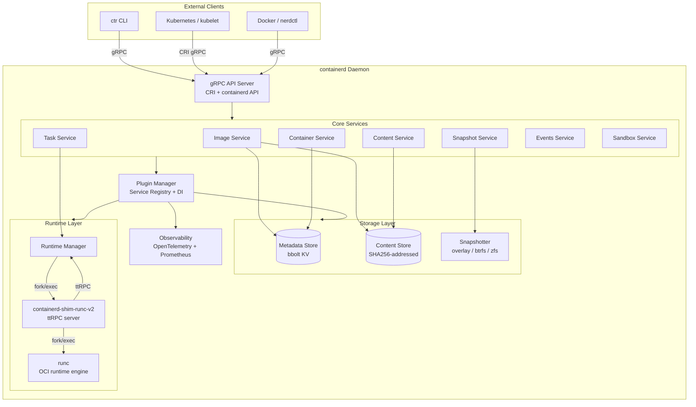

### 2.2 Namespace 多租戶架構

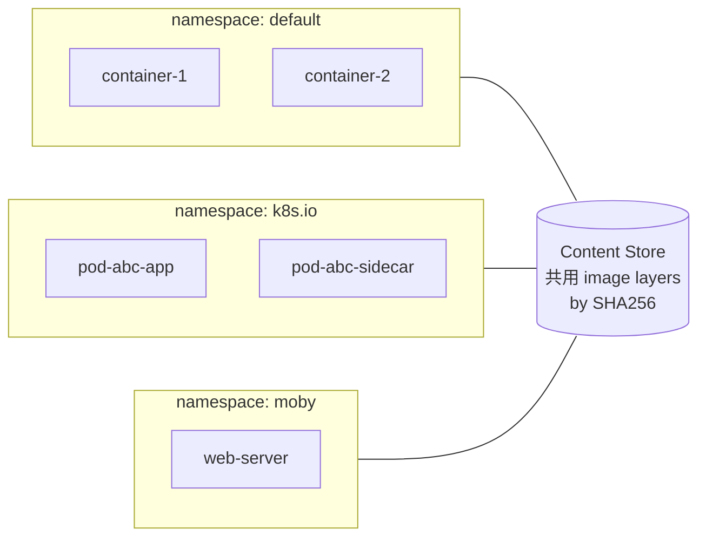

> **概念**：不同租戶的容器名稱、metadata 完全隔離，但底層 image layer 內容共享（content-addressed）。

### 2.3 Snapshotter 後端架構

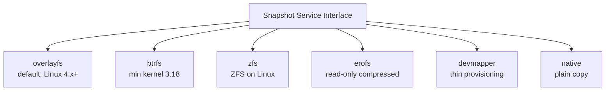

---

## 3. 靜態結構：Class Diagram（核心介面）

### 3.1 Snapshotter 介面

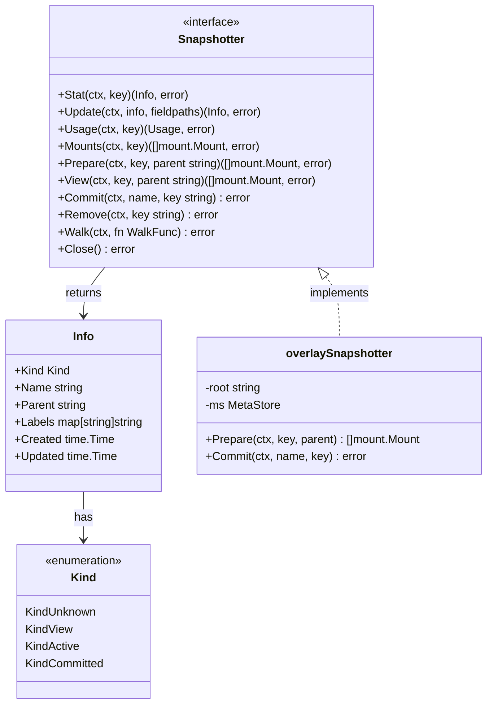

### 3.2 Plugin 系統介面

```mermaid
classDiagram
    class Plugin {
        <<interface>>
        +ID() string
        +Type() Type
        +Init(ctx InitContext) (interface{}, error)
    }

    class Registration {
        +Type Type
        +ID string
        +Config interface{}
        +Requires []Type
        +InitFn func(InitContext) interface{}
        +Disable bool
    }

    class InitContext {
        +Context context.Context
        +Root string
        +State string
        +Config interface{}
        +Address string
        +TTRPCAddress string
        +RegisterReadiness func() func()
        +Plugins *Set
    }

    class Set {
        -plugins map[string]Plugin
        +Add(Registration)
        +Get(Type, id) Plugin
        +GetAll() []Plugin
        +GetByType(Type) []Plugin
    }

    class Type {
        <<enumeration>>
        RuntimePlugin
        SnapshotPlugin
        ContentPlugin
        MetadataPlugin
        GRPCPlugin
        ServicePlugin
        EventPlugin
    }

    Registration --> InitContext : passed to InitFn
    Set --> Plugin : manages
    Registration --> Type : has
```

### 3.3 Runtime v2 Shim 介面

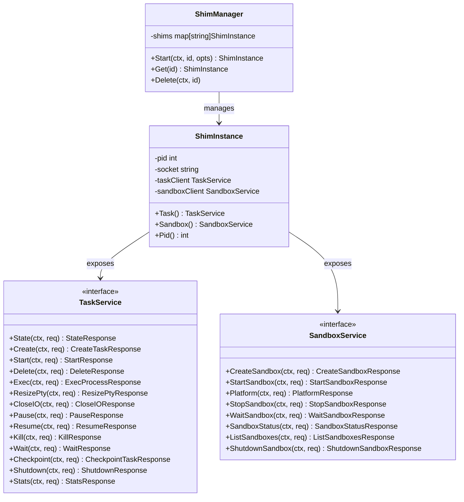

### 3.4 Content Store 介面

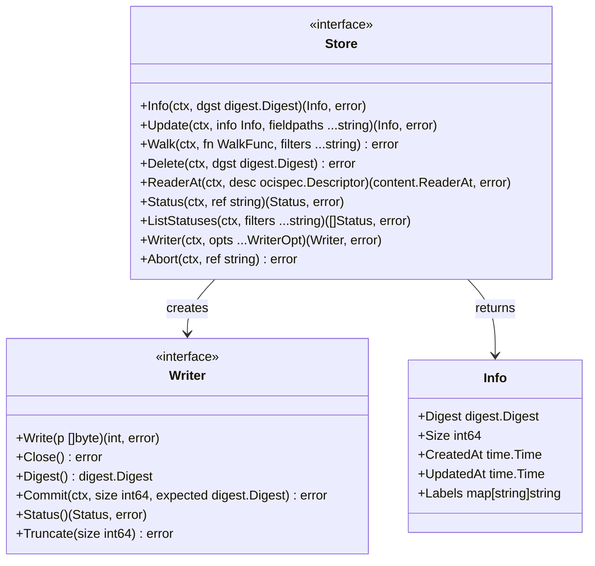

---

## 4. 動態結構：Sequence Diagram

### 4.1 Image Pull 完整流程

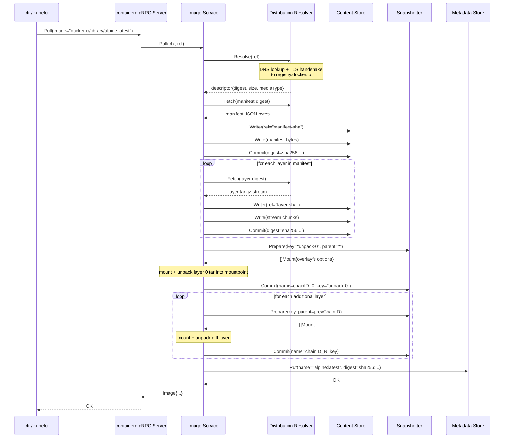

### 4.2 Container Run 完整流程（ctr run）

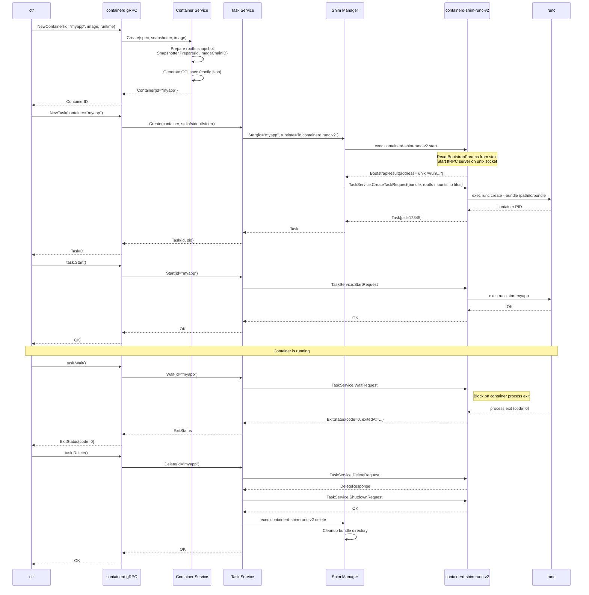

### 4.3 Kubernetes Pod 建立流程（Sandbox API）

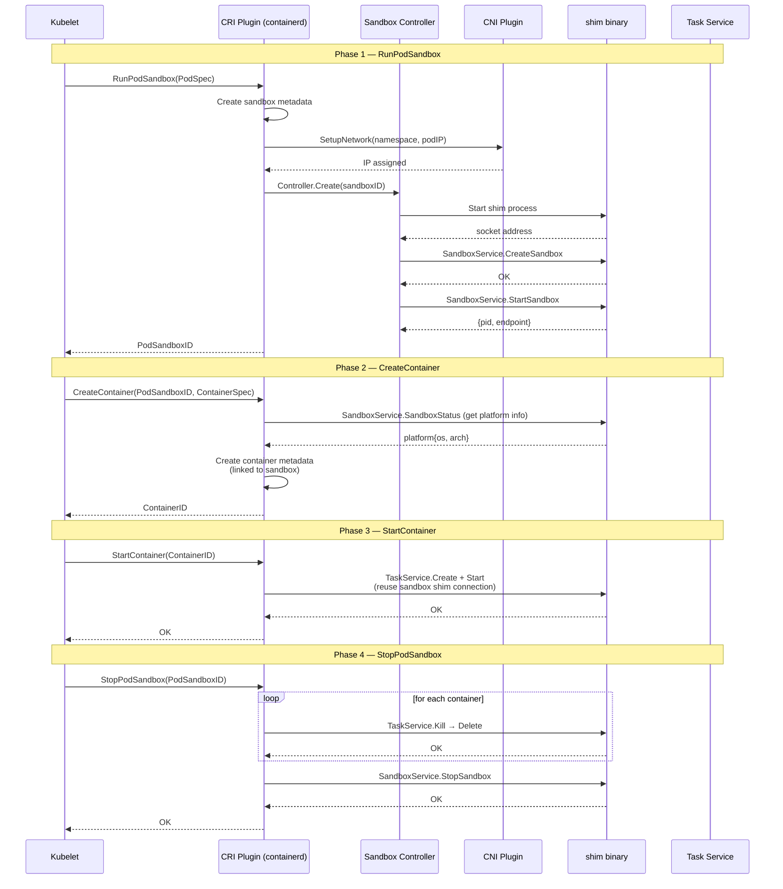

### 4.4 Event 發佈訂閱流程

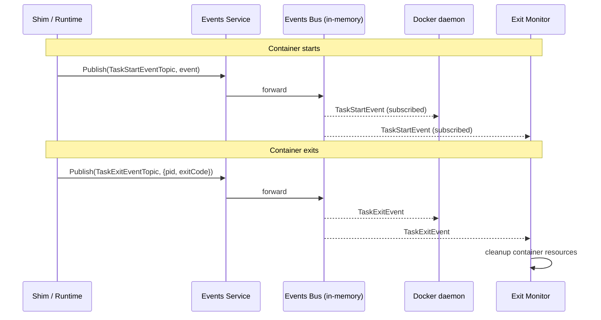

---

## 5. 動態結構：Activity Diagram

### 5.1 Snapshotter — 快照生命週期

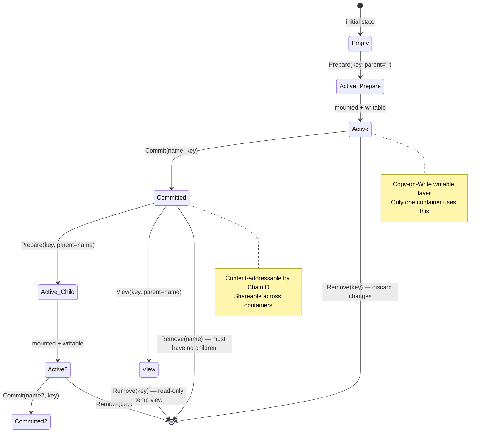

### 5.2 Container 完整生命週期 Activity

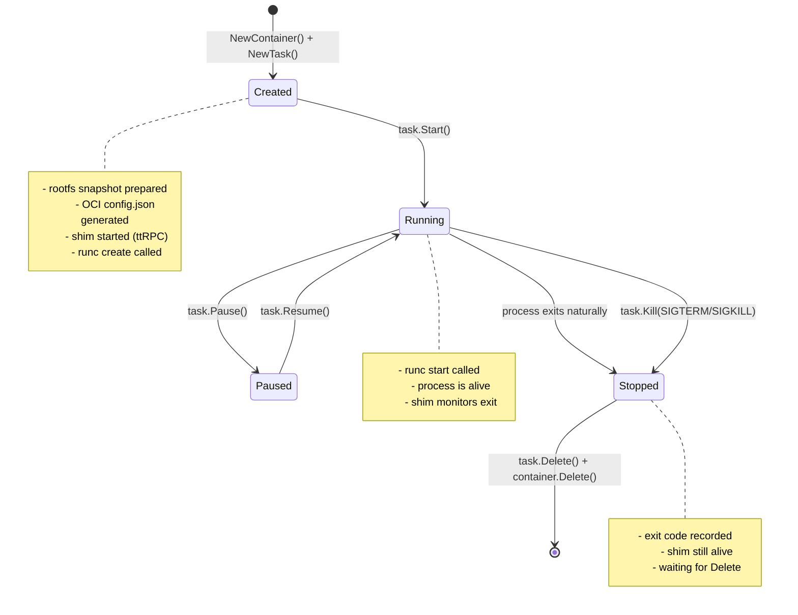

### 5.3 Plugin 初始化 Activity

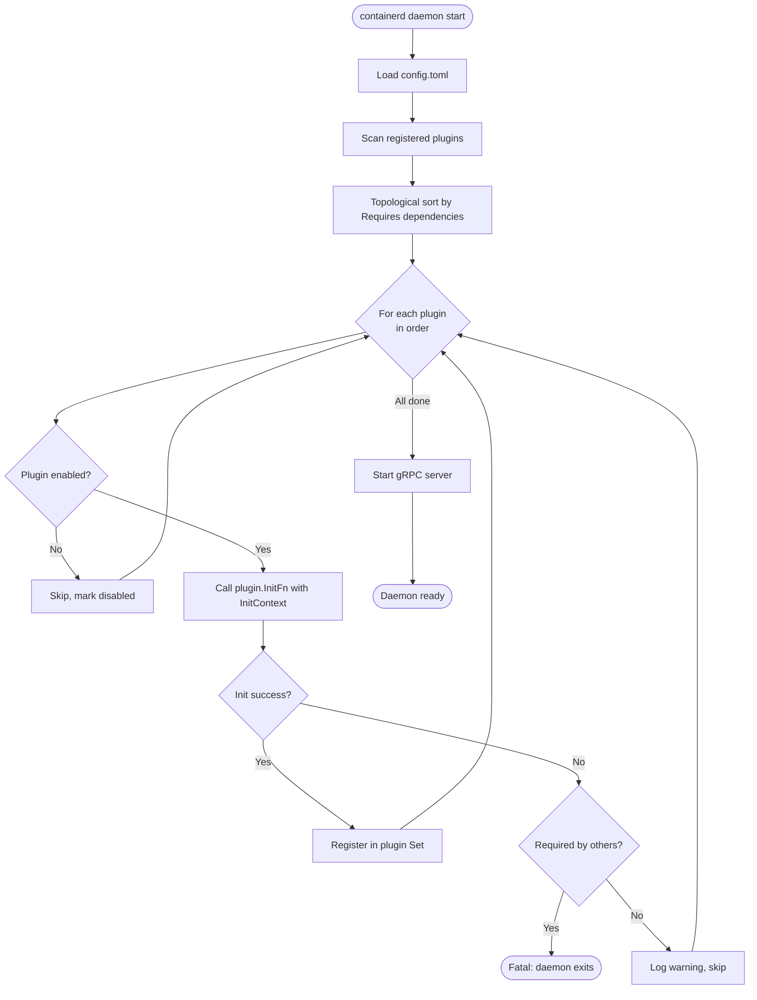

### 5.4 Image Pull + Unpack Activity（完整）

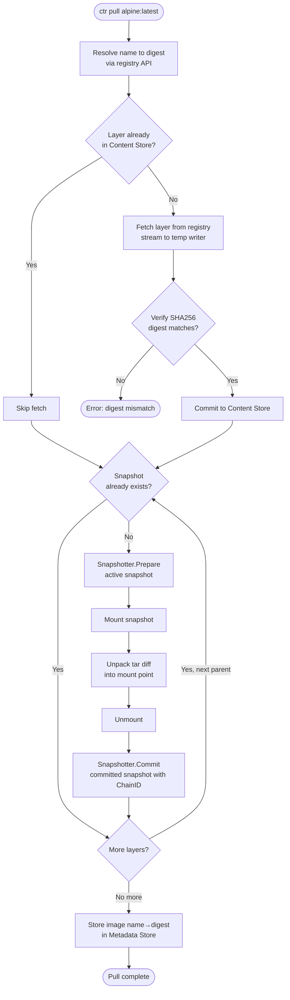

---

## 6. 設計問題與解法對應

### 6.1 問題一：Container Daemon 重啟 → 容器全死

**舊問題：**
```
Docker Daemon
    │  (parent process)
    └── container process
            │
            ▼
  daemon crash → SIGHUP → 容器全部結束
```

**containerd 的解法：Shim as Process Parent**

```
containerd daemon    containerd-shim-runc-v2    runc / container
      │                       │                       │
      │──fork/exec shim──────→│                       │
      │                       │──fork/exec runc──────→│
      │                       │←─PID─────────────────│
      │←──socket addr─────────│                       │
      │                       │  (shim holds child)   │
      │                       │                       │
  CRASH                        │                       │
      │                       │  shim 繼續存活          │
      │                       │  container 繼續執行     │
      │                       │                       │
  RESTART                      │                       │
      │──reconnect─────────→  │                       │
      │←──existing socket─────│                       │
      │                       │                       │
```

**效果**：containerd 具備 **Fault Tolerance**，滿足 Liveness property（容器不會因 daemon 問題而停止）。

---

### 6.2 問題二：Runtime 鎖死（只能用 runc）

**舊問題：**
```
Docker → 硬編碼呼叫 runc → 無法換成 gVisor / Kata / Firecracker
```

**containerd 的解法：Runtime v2 Shim 介面**

```
containerd
    │
    │  只認識 ttRPC TaskService 介面
    │
    ├──→ containerd-shim-runc-v2      → runc（Linux containers）
    ├──→ containerd-shim-kata-v2      → Kata Containers（VM-based）
    ├──→ containerd-shim-runhcs-v2    → hcsshim（Windows）
    └──→ containerd-shim-wasmedge-v1  → WasmEdge（WASM runtime）
```

**原則**：依賴抽象（ttRPC TaskService interface），不依賴具體實作。
符合課程 Broker Pattern 中的 **"Location Independence"** 和 **"Separation of Concerns"**。

---

### 6.3 問題三：Storage 層無法替換（鎖死 overlayfs）

**舊問題：**
```
Docker graphdriver：storage 邏輯與 image import/export 緊耦合
修改 storage 後端需要動到大量核心代碼
```

**containerd 的解法：Snapshotter 介面**

```go
// 任何 storage 後端只需實作這個介面
type Snapshotter interface {
    Prepare(ctx, key, parent string) ([]mount.Mount, error)
    Commit(ctx, name, key string) error
    View(ctx, key, parent string) ([]mount.Mount, error)
    Remove(ctx, key string) error
    // ...
}
```

**重點**：Snapshotter 完全不知道「image」或「container」的概念，只管理目錄快照。image 的語義由上層 Image Service 處理。這是 **Single Responsibility Principle** 在系統架構層的體現。

---

### 6.4 問題四：多個系統（Docker、k8s）無法共用同一個 runtime

**舊問題：**
```
Docker    → 有自己的 daemon
Kubernetes → 有自己的 kubelet + dockershim
兩者互相干擾，共用主機時資源難以管理
```

**containerd 的解法：Namespace 多租戶**

```
同一個 containerd daemon

namespace: moby    → Docker 的容器
namespace: k8s.io  → Kubernetes 的 pod
namespace: default → 手動 ctr 建立的容器

底層 image layers 以 content-addressed 方式共享
（alpine:latest 只存一份，三個 namespace 都可用）
```

---

### 6.5 問題五：Kubernetes Pod（多容器共享 namespace）難以實作

**舊問題：**
```
k8s 需要多個容器共享 network namespace（pause container pattern）
但舊 CRI 實作把 pause container 硬編碼在 CRI plugin 裡
→ VM-based runtime（Kata）無法插入自己的 sandbox 實作
```

**containerd 的解法：Sandbox API**

```
Sandbox Controller Interface
    │
    ├── shim controller      → 適用 runc-based sandbox（pause container）
    └── podsandbox controller → 適用 VM-based runtime（Kata VMM）
```

kubelet 透過 CRI 呼叫 `RunPodSandbox`，containerd 透過 Sandbox Controller 抽象層委派給適合的實作，無需修改 containerd 或 CRI plugin。

---

## 7. 簡報用重點整理

### Slide 1：Problem Statement

```
舊架構問題（Docker all-in-one）：
  ✗ Daemon crash → 容器全死
  ✗ Runtime 鎖死 runc，無法換 gVisor/Kata
  ✗ Storage 後端（graphdriver）與 image logic 緊耦合
  ✗ 多系統（Docker + k8s）無法共用 runtime
  ✗ Kubernetes Pod 的 sandbox 無抽象介面
```

### Slide 2：containerd 的核心設計原則

```
1. 最小化（Minimal）：只做 container lifecycle，不做 build/compose
2. 可插拔（Pluggable）：runtime、snapshotter、sandbox 均可替換
3. 標準化（Standard）：OCI image spec + runtime spec + CRI
4. 高可用（Fault Tolerant）：shim 獨立存活，daemon 重啟無痛
5. 多租戶（Multi-tenant）：namespace 隔離，content-addressed 共享
```

### Slide 3：三層解耦架構

```
Layer 1：API 解耦
  Client → gRPC interface → 不知道底層實作

Layer 2：Runtime 解耦
  containerd → ttRPC TaskService → 不知道是 runc / Kata / WASM

Layer 3：Storage 解耦
  Image Service → Snapshotter interface → 不知道是 overlay / btrfs / zfs
```

### Slide 4：Shim 解決 Fault Tolerance

```
核心洞見：
  容器的 parent process 是 shim，不是 containerd daemon
  → daemon 重啟不影響容器
  → 一個 shim 可管理多個容器（k8s pod 內的容器共用一個 shim）
  → shim crash 只影響單一容器，不影響 daemon
```

### Slide 5：對應分散式系統概念

| 分散式概念 | containerd 的實作 |
|------------|------------------|
| RPC | gRPC API（外部）/ ttRPC（internal shim）|
| Broker Pattern | Plugin Manager（服務註冊/查詢）|
| Pub/Sub | Events Bus（TaskStart/Exit 事件）|
| Fault Tolerance | Shim 獨立 process，daemon 重啟可重連 |
| Multi-tenancy | Namespace 隔離 |
| Content Addressing | Content Store（SHA256 digest as key）|
| Indirect Communication | Snapshotter interface 抽象 storage |

### Slide 6：關鍵數字與事實

```
• CNCF Graduated 狀態（與 Kubernetes、Prometheus 同級）
• Go 1.26.2，module: github.com/containerd/containerd/v2
• 支援平台：Linux（主要）、Windows（hcsshim）
• 支援 runtime：runc、Kata、runhcs、WasmEdge
• 支援 snapshotter：overlayfs、btrfs、zfs、erofs、devmapper
• 使用者：Docker、Kubernetes（所有 cloud providers）、AWS ECS
• Kubernetes 從 1.24 起移除 dockershim，直接使用 containerd
• ttRPC vs gRPC：移除 HTTP/2 overhead，降低 latency ~30%
```

### Slide 7：設計亮點總結

```
1. Shim-as-Parent：解決 daemon 重啟問題的最簡解法
   （不需要分散式協調，不需要外部 state，純 OS process 語義）

2. Content-Addressed Storage：
   不同 namespace 的容器可以零拷貝共享 image layer
   （SHA256 digest 即是唯一 ID，天然去重）

3. ttRPC over Unix socket：
   比 gRPC 輕量，但保留 Protobuf 序列化的 type safety
   （shim 是 local process，不需要 HTTP/2 的 multiplexing）

4. Plugin 系統 + Topological Sort：
   保證依賴順序初始化，同時允許 disable 任意 plugin
   （如：在 Windows 上 disable Linux-only 的 cgroups plugin）
```

---

## 附錄：關鍵原始碼位置

| 功能 | 路徑 |
|------|------|
| gRPC 服務定義 | `api/services/*/v1/*.proto` |
| Runtime v2 shim 介面 | `api/runtime/task/v3/shim.proto` |
| Sandbox API 介面 | `api/runtime/sandbox/v1/sandbox.proto` |
| Plugin 系統 | `vendor/github.com/containerd/plugin/` |
| Snapshotter 介面 | `snapshots/snapshots.go` |
| Content Store 介面 | `content/content.go` |
| Shim Manager | `runtime/v2/manager.go` |
| CRI Plugin | `internal/cri/` |
| Namespace 工具 | `namespaces/namespaces.go` |
| Bootstrap Protocol | `api/runtime/bootstrap/v1/bootstrap.proto` |
| 容器生命週期文件 | `docs/historical/design/lifecycle.md` |
| Runtime v2 文件 | `docs/runtime-v2.md` |
| Sandbox API 文件 | `docs/sandbox-api.md` |
