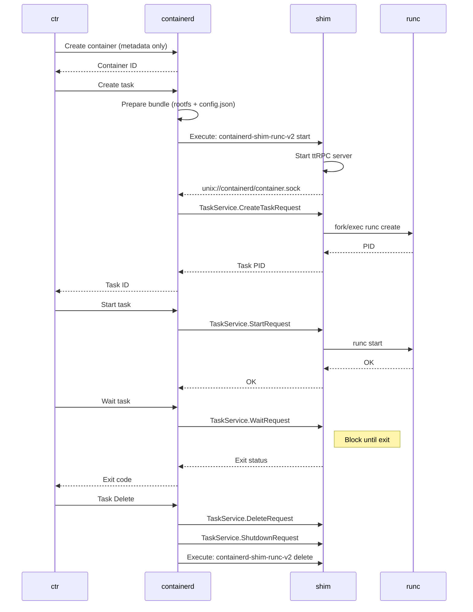

# containerd 架構解析 — 期中報告

> 課程：Distributed Systems, NCCU  
> 授課教師：Chun-Feng Liao  
> 負責部分：架構解析  
> 分析框架：Block Model (Izu et al., 2019) + Remoting Pattern

---

## 目錄

1. [期中報告要求摘要](#1-期中報告要求摘要)
2. [Block Model 分析框架](#2-block-model-分析框架)
3. [專案簡介 (Introduction)](#3-專案簡介-introduction)
4. [宏觀架構 (Macro Structure)](#4-宏觀架構-macro-structure)
5. [核心模組逐層分析 (Block-level)](#5-核心模組逐層分析-block-level)
6. [執行流程 (Program Execution)](#6-執行流程-program-execution)
7. [分散式系統特性對應 (Function/Purpose)](#7-分散式系統特性對應-functionpurpose)
8. [安裝與配置](#8-安裝與配置)
9. [評估與比較 (Evaluation)](#9-評估與比較-evaluation)
10. [AI 辯證要點](#10-ai-辯證要點)

---

## 1. 期中報告要求摘要

### 1.1 評分配置

| 項目 | 占比 | 說明 |
|------|------|------|
| Introduction | 20% | 主功能、問題定義、整體方法論 |
| Implementation | 25% | 技術原理、UML 圖、安裝使用 |
| Evaluation | 25% | 優勢、解決效果、改進空間 |
| AI 對話辯證 | — | 與 AI 討論系統特性 |
| Demo | 20% | 實作展示 |

### 1.2 撰寫原則

老師要求的論述邏輯結構：

```
Context  →  Claim  →  Justification
(背景)      (主張)     (理由/證明)
```

> 範例：  
> **Context**: 大量客戶端，無自動更新機制  
> **Claim**: 更新 client 會是噩夢  
> **Justification**: N 個 client 需要 N 次重複部署

---

## 2. Block Model 分析框架

Block Model 是程式理解的二維分類工具，用於將「理解活動」對應到不同的認知層次。

### 2.1 兩個維度

```
                  ┌──────────────┬──────────────┬──────────────┐
                  │ Text Surface │   Program    │  Function /  │
                  │     (T)      │ Execution(P) │  Purpose(F)  │
┌─────────────────┼──────────────┼──────────────┼──────────────┤
│ Atoms     (A)   │  識別語法元素  │  追蹤變數值   │  解釋單行用途  │
│ Blocks    (B)   │  識別區塊類型  │  解釋區塊行為  │  解釋區塊目的  │
│ Relation  (R)   │  標記函式呼叫  │  繪製控制流   │  功能等價比較  │
│ Macro     (M)   │  標記整體結構  │  找測試路徑   │  寫一句話摘要  │
└─────────────────┴──────────────┴──────────────┴──────────────┘
```

**12 個 Zone** = 4 個 Focus Level × 3 個 Dimension

### 2.2 Holey Quilt 理論

學習者在 12 個 zone 的知識是**不均勻**的（有洞的棉被）。  
目標：透過不同活動，**補齊**所有 zone 的理解深度。

### 2.3 本報告的 Block Model 對應

| Zone | 本報告對應內容 |
|------|--------------|
| Atoms/T | go.mod 依賴宣告語法、Makefile 目標語法 |
| Blocks/T | 各子系統目錄結構（snapshotter、cgroups、events） |
| Relations/T | gRPC service 定義、plugin 介面連結 |
| Macro/T | 整體目錄架構圖 |
| Atoms/P | ctr run 指令追蹤一個變數傳遞 |
| Blocks/P | Image pull 步驟、Bundle 建立流程 |
| Relations/P | containerd → shim → runc 呼叫序列圖 |
| Macro/P | 完整 `ctr run` 時序圖 |
| Blocks/F | Snapshotter 的目的（為何需要快照？） |
| Relations/F | 為何 shim 要解耦 containerd 和 runc？ |
| Macro/F | containerd 解決的本質問題 |

---

## 3. 專案簡介 (Introduction)

### 3.1 基本資訊

- **名稱**：containerd
- **定位**：Industry-standard container runtime（CNCF Graduated）
- **語言**：Go 1.26.2
- **License**：Apache 2.0
- **官網**：https://containerd.io

### 3.2 核心問題定義

**Context**：容器生態系統需要一個穩定、可嵌入的底層 runtime  
**Claim**：containerd 以「最小化」設計，專注於容器生命週期管理  
**Justification**：Docker 原本的架構太重且緊耦合，無法直接嵌入 Kubernetes 等平台

### 3.3 核心功能

```
containerd 負責管理：
┌─────────────────────────────────────────┐
│  1. Image transfer & storage            │  ← 拉取/推送/儲存容器映像
│  2. Container execution & supervision   │  ← 執行並監控容器
│  3. Low-level storage (snapshots)       │  ← 管理檔案系統快照
│  4. Network attachments (CNI)           │  ← 配置容器網路
│  5. Namespace & CGroup management       │  ← 資源隔離
└─────────────────────────────────────────┘
```

### 3.4 設計哲學

> **containerd is designed to be embedded into a larger system, rather than being used directly by developers or end-users.**

它不是終端使用者工具，而是 Docker、Kubernetes 等系統的核心組件。

---

## 4. 宏觀架構 (Macro Structure)

### 4.1 整體架構圖 (Component Diagram)

```
┌─────────────────────────────────────────────────────────────────┐
│                        External Clients                          │
│          Docker / Kubernetes (CRI) / ctr CLI / nerdctl           │
└────────────────────────┬────────────────────────────────────────┘
                         │ gRPC / CRI API
                         ▼
┌─────────────────────────────────────────────────────────────────┐
│                     containerd Daemon                            │
│                                                                   │
│  ┌─────────────────────────────────────────────────────────┐    │
│  │                    gRPC API Server                       │    │
│  │  ContainerService │ ImageService │ TaskService │ ...     │    │
│  └────────────────────────┬────────────────────────────────┘    │
│                            │                                      │
│  ┌─────────────────────────▼────────────────────────────────┐   │
│  │                   Plugin Manager                          │   │
│  │     (動態載入 / 服務註冊 / 依賴解析)                        │   │
│  └──┬──────────┬──────────┬──────────┬──────────┬───────────┘   │
│     │          │          │          │          │                 │
│     ▼          ▼          ▼          ▼          ▼                 │
│  ┌──────┐ ┌────────┐ ┌────────┐ ┌────────┐ ┌────────┐           │
│  │Image │ │Content │ │Snap-   │ │Metadata│ │Events  │           │
│  │Svc   │ │Store   │ │shotter │ │Store   │ │Bus     │           │
│  └──────┘ └────────┘ └────┬───┘ └───┬────┘ └────────┘           │
│                            │         │                             │
│  ┌─────────────────────────▼─────────▼──────────────────────┐   │
│  │              Runtime v2 Subsystem                         │   │
│  │       containerd → shim (ttRPC) → runc (OCI)             │   │
│  └───────────────────────────────────────────────────────────┘   │
│                                                                   │
│  ┌────────────────────────────────────────────────────────────┐  │
│  │  Observability: OpenTelemetry + Prometheus Metrics         │  │
│  └────────────────────────────────────────────────────────────┘  │
└─────────────────────────────────────────────────────────────────┘
```

### 4.2 目錄結構 (Macro/T)

```
containerd/
├── api/              ← Protobuf gRPC 服務定義
├── cmd/
│   ├── containerd/   ← 主 daemon 入口
│   ├── ctr/          ← CLI 工具
│   └── containerd-shim-runc-v2/  ← Runtime shim
├── docs/             ← 設計文件
│   └── historical/design/
│       ├── architecture.md
│       ├── data-flow.md
│       └── lifecycle.md
├── integration/      ← 整合測試
├── vendor/           ← 依賴 vendoring
├── version/          ← 版本資訊
├── go.mod            ← Go 模組定義
├── Makefile          ← 建構腳本
└── containerd.service ← systemd 服務定義
```

### 4.3 子系統劃分

```
subsystems (對外暴露 gRPC API)：
  Bundle Service   ← 打包/解包 image 成 bundle
  Runtime Service  ← 執行 bundle，建立容器

modules (跨子系統的基礎設施)：
  Executor    ← 實際執行 container runtime
  Supervisor  ← 監控容器狀態
  Metadata    ← 圖資料庫，儲存 image/bundle 持久參考
  Content     ← Content-addressable storage（以內容 hash 為 key）
  Snapshot    ← 管理容器 filesystem 快照（類比 Docker graphdriver）
  Events      ← 事件收集與分發（支援 replay）
  Metrics     ← 各組件 metrics 輸出
```

---

## 5. 核心模組逐層分析 (Block-level)

### 5.1 Content Store

**目的 (F)**：以 content-addressable 方式儲存所有不可變內容（image layers）

```
Content Store
├── 以 SHA256 digest 為 key
├── 儲存 image manifest, config, layers
├── 支援 import/export
└── 垃圾回收機制（GC with reference counting）
```

**與其他模組關係 (R)**：
```
Distribution ──pull──→ Content Store ──unpack──→ Snapshotter
```

### 5.2 Snapshotter

**目的 (F)**：管理容器的 filesystem 快照（copy-on-write 層）

```
Snapshotter 支援的後端：
┌────────────┬─────────────────────────────────────────┐
│ overlayfs  │ 預設，需要 Linux kernel 4.x+             │
│ btrfs      │ 需要 btrfs module，最低 3.18             │
│ zfs        │ 需要 ZFS on Linux                       │
│ erofs      │ 唯讀壓縮 filesystem（嵌入式優化）         │
│ devmapper  │ Device Mapper thin provisioning         │
│ blockfile  │ 基於 block 的快照                       │
└────────────┴─────────────────────────────────────────┘
```

**快照模型 (Block/T)**：
```
Base Layer (Image)
    └── Snapshot 1 (container A, Read-Only)
    └── Snapshot 2 (container B, Read-Only)
            └── Active Snapshot (container B, Read-Write)
```

### 5.3 Plugin Manager

**目的 (F)**：實現可插拔架構，允許動態載入/替換組件

```
Plugin 類型：
┌─────────────────────┬────────────────────────────────────┐
│ native plugin        │ 直接編譯進 binary（CRI 從 1.1 起）  │
│ external plugin      │ 獨立 binary，透過 gRPC 介面連接     │
│ runtime plugin       │ shim binary（containerd-shim-*）   │
└─────────────────────┴────────────────────────────────────┘
```

**Broker Pattern 對應**（符合課程 Remoting 章節）：
```
新服務 ──register──→ Plugin Manager (Broker)
客戶端 ──lookup──→ Plugin Manager ──→ Stub ──→ 真實服務
```

### 5.4 Runtime v2 / Shim

**目的 (F)**：將 containerd 與具體的 container runtime (runc) 解耦

```
containerd (daemon)
    │
    │ ttRPC (Unix socket)
    ▼
containerd-shim-runc-v2 (shim binary)
    │
    │ fork/exec + OCI runtime spec
    ▼
runc (OCI compliant runtime engine)
    │
    │ libcontainer → kernel syscalls
    ▼
Container Process
```

**為何需要 Shim 層？**

| 問題 | Shim 的解法 |
|------|-----------|
| containerd 重啟時容器不能死 | Shim 是容器 process 的直接 parent，獨立於 daemon |
| containerd 不應依賴特定 runtime 實作 | Shim 實作 ttRPC 介面，runtime 自行替換 |
| 一個 shim 可管理多個容器 | 以 pod label 分組（Kubernetes pod 共用同一 shim） |

### 5.5 Events Bus

**目的 (F)**：實現非同步事件通知，解耦組件間的直接依賴

```
事件類型（Runtime v2 MUST 實作）：
  TaskCreateEventTopic
  TaskStartEventTopic
  TaskExitEventTopic
  TaskDeleteEventTopic

事件類型（SHOULD 實作）：
  TaskPausedEventTopic
  TaskResumedEventTopic
  TaskCheckpointedEventTopic
  TaskOOMEventTopic
```

---

## 6. 執行流程 (Program Execution)

### 6.1 Image Pull 流程 (Sequence Diagram)

```
ctr                    containerd              Content Store        Snapshotter
 │                         │                       │                    │
 │── pull image ──────────→│                       │                    │
 │                         │── fetch manifest ────→│                    │
 │                         │←─ manifest ───────────│                    │
 │                         │── fetch layers ───────→│                   │
 │                         │←─ layers ─────────────│                    │
 │                         │── store by digest ────→│                   │
 │                         │── register name/digest→│                   │
 │                         │── unpack layers ───────────────────────────→│
 │                         │←─ snapshot ID ─────────────────────────────│
 │←─ image ready ──────────│                       │                    │
```

### 6.2 Container Run 完整時序圖 (ctr run)



### 6.3 Data Flow 圖 (Bundle 建立)

```
Distribution Layer
        │
        │ 1. fetch & store layers
        ▼
  Content Store ──────── content-addressable (SHA256)
        │
        │ 2. unpack layers
        ▼
   Snapshotter ──────── overlay layers stacked
        │
        │ 3. prepare rootfs mount
        ▼
  Bundle Controller
        │
        │ 4. merge image config → config.json
        ▼
     Bundle (config.json + rootfs/)
        │
        │ 5. pass to runtime
        ▼
   Runtime Subsystem ──→ shim ──→ runc ──→ Container
```

### 6.4 Container Lifecycle State Machine

```
         ┌──────────────────────────────────────────────┐
         │                                              │
         ▼                                              │
      Created ──── Start ────→ Running ──── Kill ────→ Stopped
         │                       │                       │
         │                   Pause/Resume                │
         │                       │                       │
         │                   Paused ◄──────────────────→ │
         │                                               │
         └──────────────── Delete ───────────────────────┘
                                 │
                                 ▼
                             [Removed]
```

---

## 7. 分散式系統特性對應 (Function/Purpose)

### 7.1 通訊模式對應（課程 Remoting 章節）

**直接通訊 (Direct Communication / RPC)**：

```
containerd (client)
    │
    │ gRPC (Direct, Synchronous)
    ▼
Service (e.g., ImageService)
```

containerd 對外提供 gRPC API，屬於**直接通訊**模式。

優點：開發簡單，呼叫行為清晰  
缺點：緊耦合（但透過 Broker pattern 緩解）

**間接通訊 (Indirect Communication / Broker)**：

```
新服務上線 ──register──→ Plugin Manager (Broker)
                              │
客戶端 ──lookup stub──────────┤
                              │
                              └──→ 真實服務
```

Plugin Manager 作為 Broker，實現了：
- **Space decoupling**：客戶端不知道服務的真實位址
- **Pluggability**：可替換 snapshotter、runtime 等

**Events Bus（最接近間接通訊）**：

```
Producer ──publish──→ Events Bus ──subscribe──→ Consumer 1
                                  └──subscribe──→ Consumer 2
```

Events Bus 實現了真正的 **Publish-Subscribe**，完全解耦生產者與消費者。

### 7.2 NFR (Non-Functional Requirements) 分析

| NFR | containerd 的設計對應 |
|-----|----------------------|
| **Scalability** | 無狀態 API + 外部 Metadata Store，可水平擴展 |
| **Availability** | Container lifecycle 與 daemon 解耦（shim 獨立存活） |
| **Fault-tolerance** | containerd crash 後重啟可重連 shim，容器不受影響 |
| **Latency** | ttRPC（比 gRPC 輕量），shim 本地 socket 通訊 |
| **Consistency** | bbolt 嵌入式 KV store，強一致性 metadata |
| **Security** | SELinux / AppArmor / Seccomp 支援，namespace 隔離 |
| **Maintainability** | Plugin 架構，新功能不需修改 core |

### 7.3 獨立故障 (Independent Failures)

```
情境：containerd daemon crash

Docker 舊架構：
  daemon crash → 所有容器 stop（緊耦合）

containerd 架構：
  daemon crash → shim 繼續運行（獨立 parent process）
               → 容器繼續執行
               → daemon 重啟後重連 shim
               → 無縫恢復
```

### 7.4 Stub / Skeleton Pattern（課程 Remoting 章節對應）

```
Client (ctr)
    │
    │ 呼叫 containerd Go SDK（Stub）
    │ 不知道底層是 gRPC / socket / 本地
    ▼
containerd SDK (Stub)
    │
    │ Serialization (Protobuf marshalling)
    │ gRPC transport
    ▼
containerd Server (Skeleton)
    │
    │ Deserialization (Protobuf unmarshalling)
    │ 呼叫真實 Service
    ▼
ImageService / ContainerService / ...
```

---

## 8. 安裝與配置

### 8.1 安裝方式

**方法一：系統套件（推薦）**
```bash
# Ubuntu/Debian
apt-get install -y containerd

# RHEL/CentOS
yum install -y containerd.io
```

**方法二：從源碼編譯**
```bash
git clone https://github.com/containerd/containerd
cd containerd
make binaries
make install
```

**方法三：Release tarball**
```bash
# 下載 binary
wget https://github.com/containerd/containerd/releases/download/v2.x.x/containerd-2.x.x-linux-amd64.tar.gz
tar -xzf containerd-*.tar.gz -C /usr/local
```

**依賴項安裝**：
```bash
# 安裝 runc + CNI + critools
make install-deps

# 或分開安裝
script/setup/install-runc
script/setup/install-cni
script/setup/install-critools
```

### 8.2 啟動服務

```bash
# systemd
systemctl enable --now containerd

# 驗證
systemctl status containerd
```

containerd.service 內容：
```ini
[Unit]
Description=containerd container runtime
After=network.target

[Service]
ExecStart=/usr/local/bin/containerd
Delegate=yes
KillMode=process

[Install]
WantedBy=multi-user.target
```

### 8.3 配置檔 (/etc/containerd/config.toml)

```toml
version = 3

[plugins]
  # CRI plugin（Kubernetes 整合）
  [plugins."io.containerd.grpc.v1.cri"]
    sandbox_image = "registry.k8s.io/pause:3.9"

    [plugins."io.containerd.grpc.v1.cri".containerd]
      [plugins."io.containerd.grpc.v1.cri".containerd.runtimes]
        [plugins."io.containerd.grpc.v1.cri".containerd.runtimes.runc]
          runtime_type = "io.containerd.runc.v2"

  # Snapshotter 設定
  [plugins."io.containerd.snapshotter.v1.overlayfs"]
    upperdir_label = false
```

### 8.4 常用指令 (ctr CLI)

```bash
# Image 操作
ctr images pull docker.io/library/alpine:latest
ctr images list
ctr images push myregistry.io/myimage:tag

# Container 操作
ctr run --rm docker.io/library/alpine:latest mycontainer sh
ctr containers list
ctr containers delete mycontainer

# Task 操作
ctr tasks list
ctr tasks kill mycontainer

# Content 操作
ctr content list
ctr content fetch docker.io/library/ubuntu:latest

# Snapshot 操作
ctr snapshots list
ctr snapshots info mycontainer
```

### 8.5 Kubernetes 整合 (CRI)

```bash
# 確認 CRI 正常運作
crictl --runtime-endpoint unix:///var/run/containerd/containerd.sock info

# 列出 pods
crictl pods

# 列出容器
crictl ps -a
```

---

## 9. 評估與比較 (Evaluation)

### 9.1 與 Docker 比較

```
Docker 架構（舊）：
  Client ──→ Docker CLI
               ──→ dockerd (all-in-one daemon)
                     ──→ containerd
                           ──→ shim ──→ runc

containerd 架構：
  Client ──→ ctr / kubectl
               ──→ containerd (只做 runtime)
                     ──→ shim ──→ runc
```

| 特性 | Docker | containerd |
|------|--------|-----------|
| 功能範圍 | 完整 container platform | 僅 runtime |
| 設計目標 | 開發者體驗 | 嵌入式平台 |
| 重量 | 較重（包含 build, compose 等） | 輕量 |
| Kubernetes 整合 | 需透過 dockershim（已棄用） | 原生 CRI 支援 |
| OCI 標準 | 支援 | 完全符合 |
| CNCF 狀態 | 非 CNCF | Graduated |

### 9.2 優點

1. **架構清晰**：單一職責，只做 runtime lifecycle
2. **高可用**：daemon 重啟不影響運行中的容器
3. **可插拔**：snapshotter、runtime 均可替換
4. **符合標準**：OCI image spec + runtime spec + CRI
5. **效能**：ttRPC 比 gRPC 更輕量（移除 HTTP/2 overhead）

### 9.3 缺點與改進空間

1. **學習曲線**：相比 Docker，ctr CLI 較不直覺
2. **日誌可觀測性**：事件追蹤的視覺化工具不足
3. **Plugin 熱重載**：修改 plugin 仍需重啟 daemon
4. **Windows 支援**：功能不如 Linux 完整
5. **文件分散**：設計文件散落於 `docs/historical/` 下

### 9.4 解決了什麼問題？

**Context**：Kubernetes 需要一個輕量、標準化的 container runtime  
**Claim**：containerd 成功解耦了「container 管理」與「container 執行」的職責  
**Justification**：
- CRI plugin 使 Kubernetes 直接對接 containerd，繞過 Docker 複雜的架構
- shim 設計使 containerd 本身的高可用不依賴於 OS process 存活
- Plugin 架構允許雲服務商替換 snapshotter（如 AWS 使用自訂的 FUSE snapshotter）

---

## 10. AI 辯證要點

### 10.1 架構選擇辯證

**問題 1：為何選擇 gRPC 而非 REST API？**

> **Claim**：gRPC 對於容器 runtime 場景更合適  
> **Justification**：  
> - 效能：Binary Protobuf 比 JSON 小且快  
> - Streaming：gRPC 支援 bidirectional streaming（容器 IO 需要）  
> - Type safety：Protobuf IDL 強制介面一致  
> - 缺點：gRPC 不如 REST 通用，debug 工具較少

**問題 2：為何 shim 要是獨立 binary 而非 library？**

> **Claim**：獨立 binary 提供更好的故障隔離  
> **Justification**：  
> - shim crash 不影響 containerd daemon  
> - 每個容器有獨立的 process，OS 可以回收資源  
> - 允許不同容器使用不同版本的 shim（混合 runtime）  
> - 缺點：更多 IPC overhead（ttRPC socket）

**問題 3：Plugin Manager 是否算是 Broker Pattern？**

> **Claim**：是的，但是簡化版的 Broker  
> **Justification**：  
> - 符合 Broker 的核心：服務主動 register，客戶端 lookup  
> - 不同之處：沒有持久化的訊息隊列（非 MOM）  
> - 本質上是 Service Discovery + Dependency Injection 的組合

### 10.2 分散式系統特性辯證

**問題 4：containerd 如何處理 Race Condition？**

> **Context**：多個 client 同時對同一個 container 操作  
> **Claim**：containerd 使用 mutex locking 在 daemon 層處理  
> **Justification**：  
> - metadata store (bbolt) 提供 ACID transaction  
> - daemon 內部使用 Go channel + mutex 協調  
> - 但這是 Single Host 解法，不適用於分散式場景

**問題 5：containerd 有 No Global Clock 問題嗎？**

> **Context**：多個 containerd 實例在 cluster 中  
> **Claim**：containerd 本身不直接處理 global clock  
> **Justification**：  
> - 依賴上層系統（Kubernetes etcd）提供分散式協調  
> - 本地的 event ordering 依賴 logical timestamps  
> - Task event 有嚴格的 happens-before 語義（Create → Start → Exit → Delete）

### 10.3 與課程 Remoting 章節的對應

| 課程概念 | containerd 對應 |
|---------|----------------|
| RPC | ctr → containerd gRPC API |
| Stub | containerd Go client SDK |
| Skeleton | containerd gRPC Server handler |
| Serialization | Protobuf marshalling/unmarshalling |
| Broker | Plugin Manager (service registry) |
| Indirect Communication | Events Bus (pub/sub) |
| Tight Coupling (壞) | 舊 Docker all-in-one daemon |
| Space Decoupling | Plugin 可部署在不同位置 |
| Time Decoupling | 非同步事件、shim 獨立存活 |

---

## 附錄

### A. 關鍵依賴說明 (go.mod 重要項目)

```
github.com/containerd/containerd/api  ← gRPC 服務定義
github.com/containerd/ttrpc           ← 輕量 RPC（用於 shim）
github.com/containerd/plugin          ← Plugin 管理
google.golang.org/grpc                ← 外部 gRPC
k8s.io/cri-api                        ← Kubernetes CRI 介面定義
go.etcd.io/bbolt                      ← 嵌入式 KV (metadata store)
go.opentelemetry.io/otel              ← 可觀測性
github.com/prometheus/client_golang   ← Metrics
github.com/opencontainers/runtime-spec← OCI 規格
github.com/tetratelabs/wazero         ← WASM runtime 支援
```

### B. 版本資訊

```
Module: github.com/containerd/containerd/v2
Go:     1.26.2
Build targets: ctr, containerd, containerd-stress
Shim:   containerd-shim-runc-v2
```

### C. 參考資料

1. containerd README: https://github.com/containerd/containerd
2. containerd Architecture Doc: `docs/historical/design/architecture.md`
3. Runtime v2 Doc: `docs/runtime-v2.md`
4. Izu et al. (2019). Program comprehension: Identifying learning trajectories for novice programmers. ITiCSE '19
5. NCCE Block Model Quick Read: https://media.teachcomputing.org/QR_12_Block_model_8956b6555c.pdf
6. Liao, C-F. NCCU Distributed Systems Course Introduction (2025)
7. Liao, C-F. NCCU Distributed Systems Remoting Lecture (2025)
