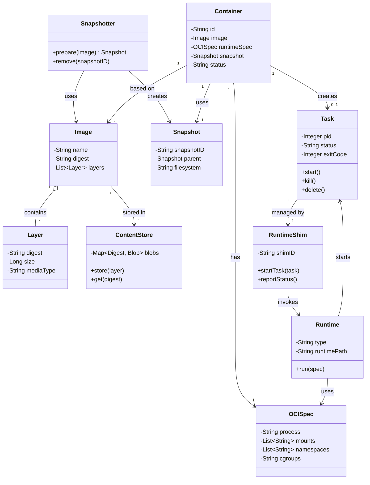
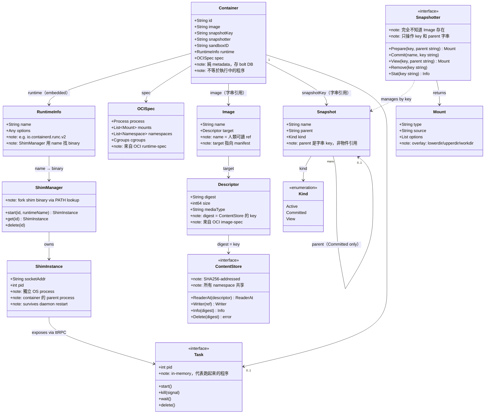
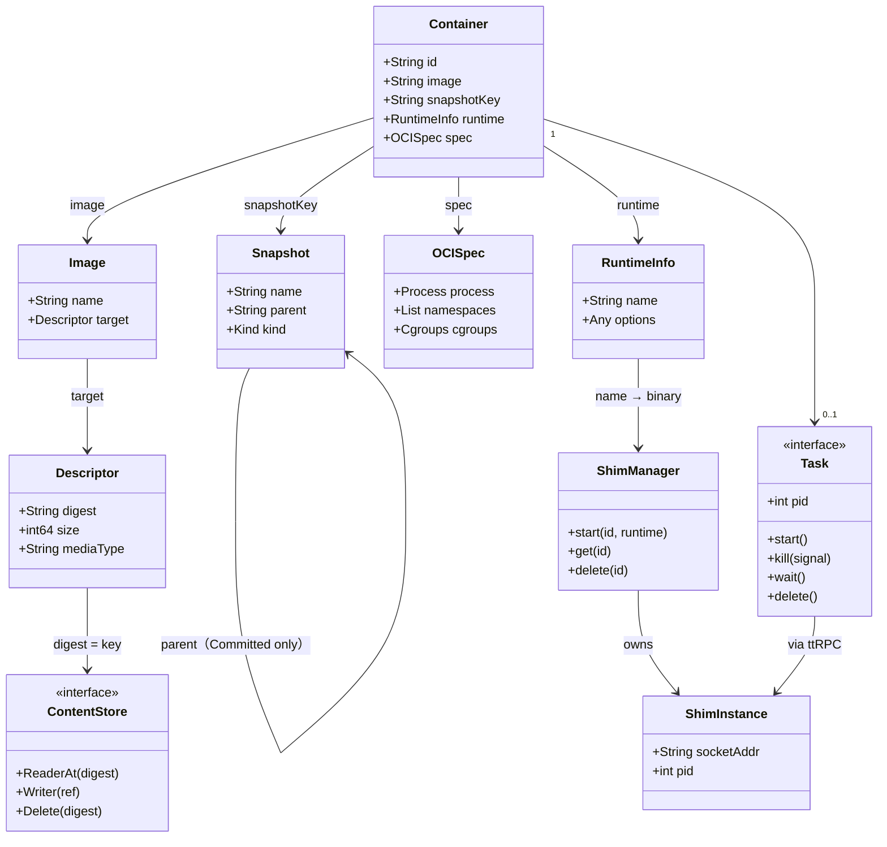
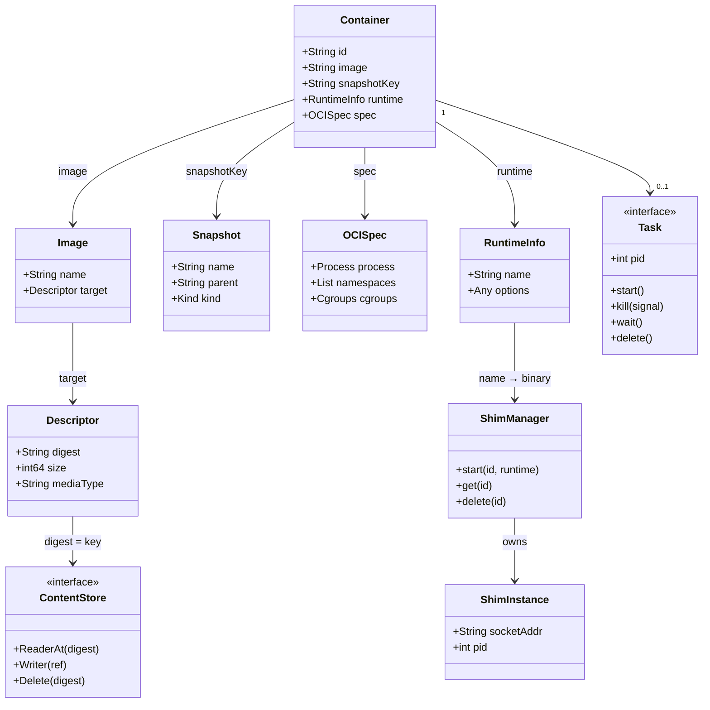
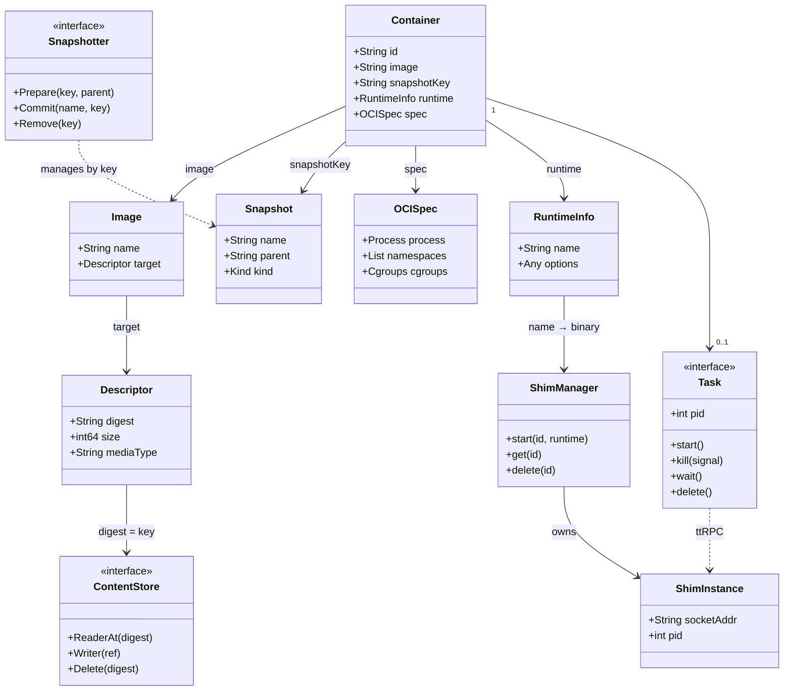

# Class Diagram 版本演進紀錄

> 記錄從同學原版到最終確認版的所有版本，以及每次修改的原因

---

## 版本總覽

| 版本 | 主要問題 | 修正重點 |
|------|---------|---------|
| V0 原版（同學） | Snapshotter→Image 錯誤、Runtime 虛構 class、缺 Descriptor | 基準版 |
| V1 完整修正版 | note 太多、版面爆炸 | 修正結構錯誤、加入所有元件 |
| V2 精簡版 | Snapshotter/Kind/Mount 被拿掉、Task 層級錯誤 | 去除 note，縮減版面 |
| V3 修正 Task 層 | Task 被 renderer 拉到底層 | 拿掉 Task→ShimInstance 連線 |
| V4 最終確認版 | — | 加回 Snapshotter、虛線連 Task↔ShimInstance |

---

## V0 — 同學原版

**來源**：`docs/gpt_res/mer.md`

**存在的錯誤**：
1. `Snapshotter --> Image : uses` — 錯誤。Snapshotter 完全不知道 Image 存在，只接受字串 key
2. `Runtime` 是虛構的獨立 class — 實際上只有 `RuntimeInfo`（Container 的 embedded struct）
3. 缺少 `Descriptor`（Image → ContentStore 之間的橋樑）
4. `RuntimeShim` 對應的應是 `ShimInstance`，名稱不準確



---

## V1 — 完整修正版（含 notes）

**修正內容**：
- 刪除 `Snapshotter --> Image`，改成 `Snapshotter ..> Snapshot : manages by key`
- 移除虛構的 `Runtime` class，改為 `RuntimeInfo`（Container 的 embedded field）
- 加入 `Descriptor`（Descriptor.digest = ContentStore 的 key）
- 加入 Kind enum
- 所有元件加 note 說明

**問題**：note 太多導致每個 class box 過大，版面爆炸



---

## V2 — 精簡版（去除 notes）

**修正內容**：
- 移除所有 note 欄位
- 移除 Mount（實作細節，不屬於 class diagram 的概念層）
- 移除 Kind enum（`kind: Kind` 欄位已說明）
- Snapshot self-loop 保留（但問題尚存：太大）
- Task → ShimInstance 連線存在

**問題**：`ShimInstance --> Task` 導致 renderer 把 Task 拉到最底層（level 4+）



---

## V3 — 修正 Task 層級

**問題分析**：
- `Task --> ShimInstance` 讓 mermaid renderer 把 Task 拉到 ShimInstance（level 4）的下一層
- Snapshot self-loop 跨層箭頭太長

**修正內容**：
- 拿掉 `Task --> ShimInstance` 連線（Task 和 ShimInstance 的關係改由口頭說明）
- 拿掉 Snapshot self-loop（`parent: String` 欄位已說明遞迴關係）



**Layer 結構（此版本確認正確）**：
```
Level 1  Container
Level 2  Image   Snapshot   OCISpec   RuntimeInfo   Task
Level 3  Descriptor                   ShimManager
Level 4  ContentStore                 ShimInstance
```

---

## V4 — 最終確認版

**在 V3 基礎上**：
- 加回 `Snapshotter`（service 層的介面，用虛線連到 Snapshot）
- 加回 `Task ..> ShimInstance : ttRPC`（改為虛線，避免被 renderer 視為樹狀依賴而拉層）

**虛線語義說明**：
- `Snapshotter ..> Snapshot`：Snapshotter 不持有 Snapshot 物件，透過字串 key 操作 bolt DB（使用關係，非擁有）
- `Task ..> ShimInstance`：Task 每個方法底層是 ttRPC call，不持有物件引用（依賴關係，非擁有）



---

## 各版本關鍵決策對照表

| 元件 | V0 | V1 | V2 | V3 | V4（最終） |
|------|----|----|----|----|-----------|
| Snapshotter | ✅（但箭頭錯誤） | ✅（修正） | ❌ 移除 | ❌ 移除 | ✅ 虛線 |
| Runtime（虛構） | ✅（錯誤） | ❌ 改 RuntimeInfo | ❌ | ❌ | ❌ |
| RuntimeInfo | ❌ 缺 | ✅ | ✅ | ✅ | ✅ |
| Descriptor | ❌ 缺 | ✅ | ✅ | ✅ | ✅ |
| Kind enum | ✅ | ✅ | ❌ 移除 | ❌ | ❌ |
| Mount | ❌ | ✅ | ❌ 移除 | ❌ | ❌ |
| Snapshot self-loop | ✅（很大） | ✅ | ✅ | ❌ 移除 | ❌ |
| Task→ShimInstance | 實線 | 實線 | 實線（拉層） | ❌ 移除 | ✅ 虛線 |
| notes | ❌ | ✅ | ❌ | ❌ | ❌ |
