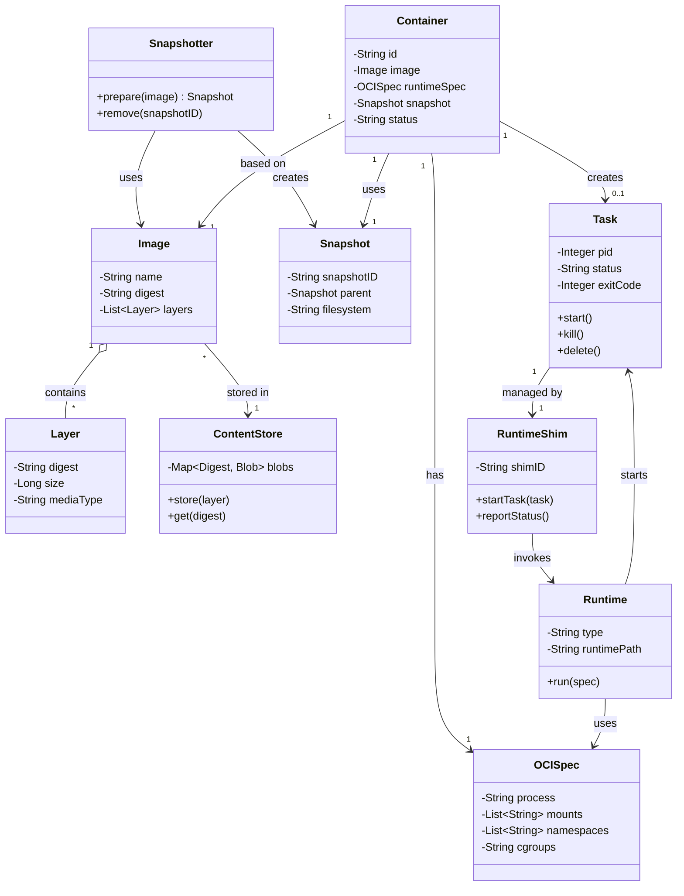
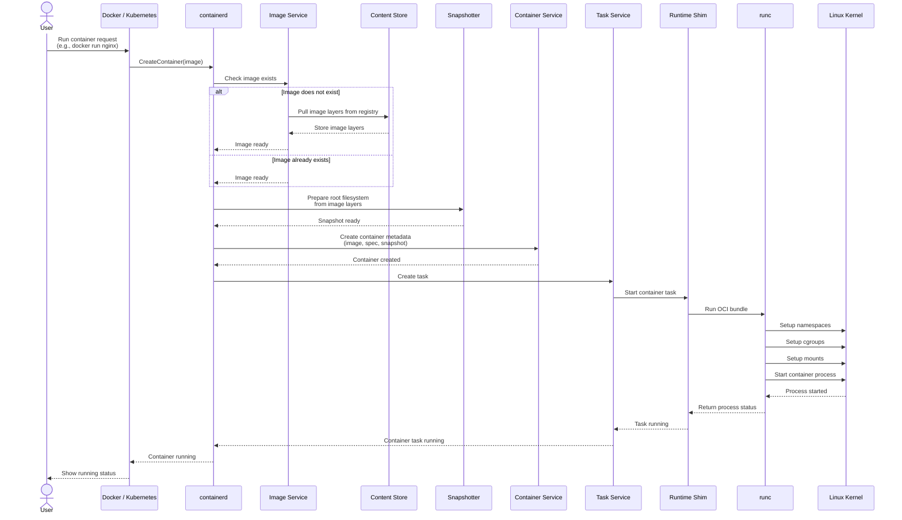
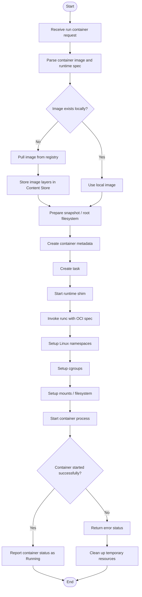

```mermaid
classDiagram
    class Image {
        -String name
        -String digest
        -List~Layer~ layers
    }

    class Layer {
        -String digest
        -Long size
        -String mediaType
    }

    class ContentStore {
        -Map~Digest, Blob~ blobs
        +store(layer)
        +get(digest)
    }

    class Snapshotter {
        +prepare(image) Snapshot
        +remove(snapshotID)
    }

    class Snapshot {
        -String snapshotID
        -Snapshot parent
        -String filesystem
    }

    class Container {
        -String id
        -Image image
        -OCISpec runtimeSpec
        -Snapshot snapshot
        -String status
    }

    class Task {
        -Integer pid
        -String status
        -Integer exitCode
        +start()
        +kill()
        +delete()
    }

    class Runtime {
        -String type
        -String runtimePath
        +run(spec)
    }

    class RuntimeShim {
        -String shimID
        +startTask(task)
        +reportStatus()
    }

    class OCISpec {
        -String process
        -List~String~ mounts
        -List~String~ namespaces
        -String cgroups
    }

    Image "1" o-- "*" Layer : contains
    Image "*" --> "1" ContentStore : stored in
    Snapshotter --> Image : uses
    Snapshotter --> Snapshot : creates
    Container "1" --> "1" Image : based on
    Container "1" --> "1" Snapshot : uses
    Container "1" --> "1" OCISpec : has
    Container "1" --> "0..1" Task : creates
    Task "1" --> "1" RuntimeShim : managed by
    RuntimeShim --> Runtime : invokes
    Runtime --> OCISpec : uses
    Runtime --> Task : starts
```

```mermaid
sequenceDiagram
    actor User
    participant Upper as Docker / Kubernetes
    participant Containerd as containerd
    participant Image as Image Service
    participant Content as Content Store
    participant Snapshotter
    participant ContainerSvc as Container Service
    participant TaskSvc as Task Service
    participant Shim as Runtime Shim
    participant Runc as runc
    participant Kernel as Linux Kernel

    User->>Upper: Run container request<br/>(e.g., docker run nginx)
    Upper->>Containerd: CreateContainer(image)

    Containerd->>Image: Check image exists

    alt Image does not exist
        Image->>Content: Pull image layers from registry
        Content-->>Image: Store image layers
        Image-->>Containerd: Image ready
    else Image already exists
        Image-->>Containerd: Image ready
    end

    Containerd->>Snapshotter: Prepare root filesystem<br/>from image layers
    Snapshotter-->>Containerd: Snapshot ready

    Containerd->>ContainerSvc: Create container metadata<br/>(image, spec, snapshot)
    ContainerSvc-->>Containerd: Container created

    Containerd->>TaskSvc: Create task
    TaskSvc->>Shim: Start container task
    Shim->>Runc: Run OCI bundle

    Runc->>Kernel: Setup namespaces
    Runc->>Kernel: Setup cgroups
    Runc->>Kernel: Setup mounts
    Runc->>Kernel: Start container process

    Kernel-->>Runc: Process started
    Runc-->>Shim: Return process status
    Shim-->>TaskSvc: Task running
    TaskSvc-->>Containerd: Container task running
    Containerd-->>Upper: Container running
    Upper-->>User: Show running status
```

```mermaid
flowchart TD
    A([Start]) --> B[Receive run container request]
    B --> C[Parse container image and runtime spec]
    C --> D{Image exists locally?}

    D -->|Yes| E[Use local image]
    D -->|No| F[Pull image from registry]
    F --> G[Store image layers in Content Store]
    G --> H[Prepare snapshot / root filesystem]
    E --> H

    H --> I[Create container metadata]
    I --> J[Create task]
    J --> K[Start runtime shim]
    K --> L[Invoke runc with OCI spec]

    L --> M[Setup Linux namespaces]
    M --> N[Setup cgroups]
    N --> O[Setup mounts / filesystem]
    O --> P[Start container process]

    P --> Q{Container started successfully?}
    Q -->|Yes| R[Report container status as Running]
    Q -->|No| S[Return error status]
    S --> T[Clean up temporary resources]

    R --> U([End])
    T --> U
```
