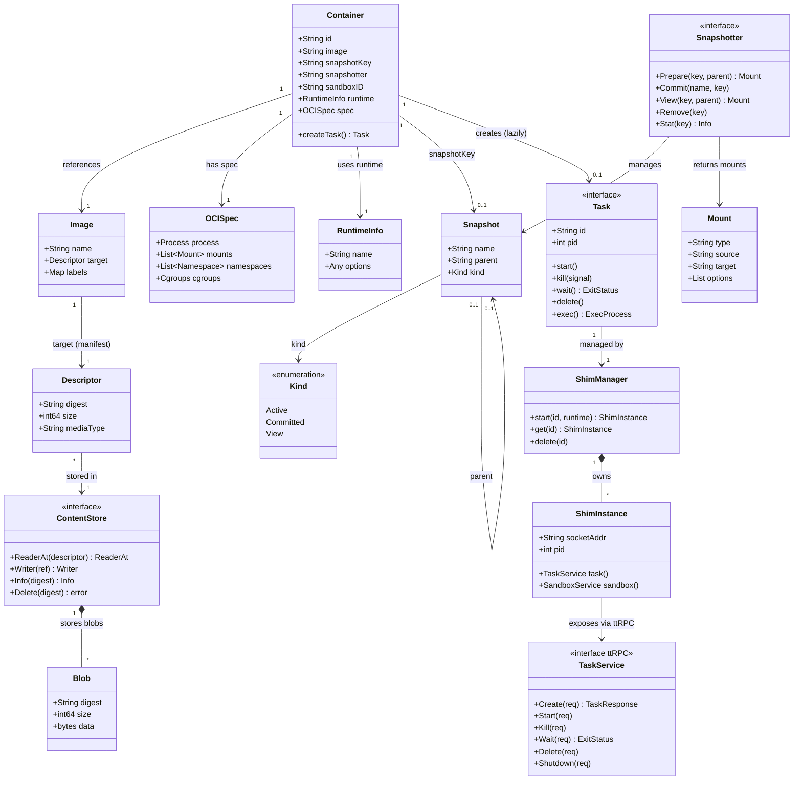
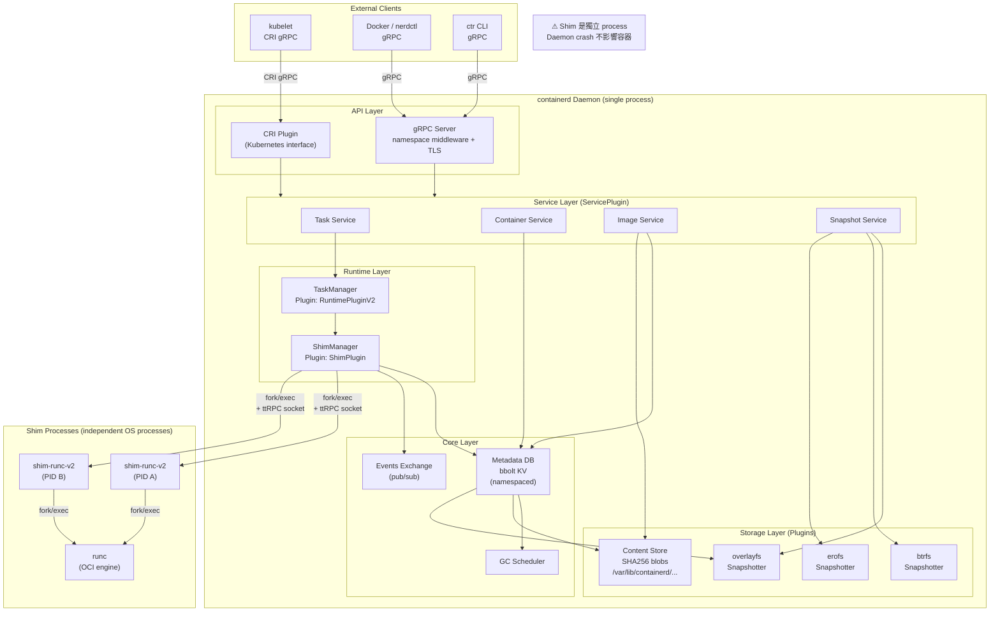
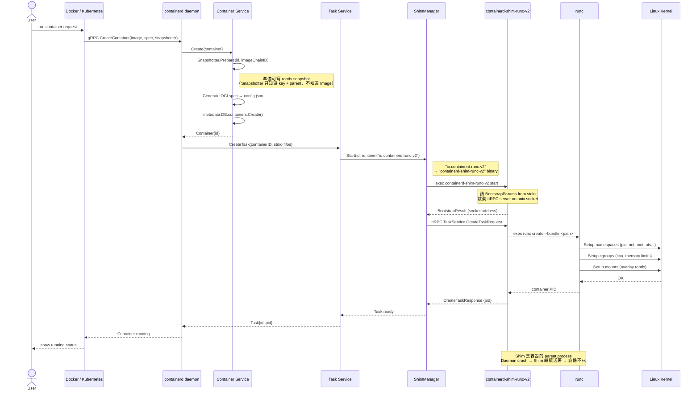
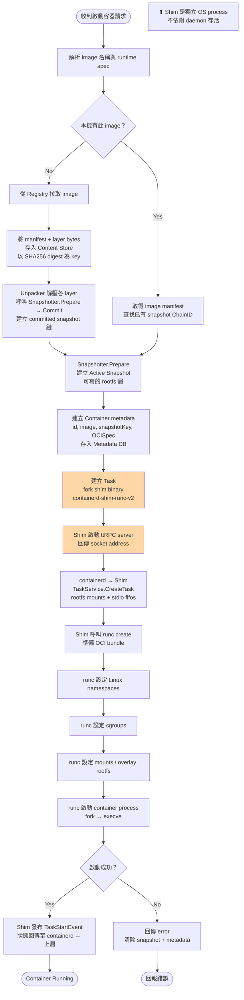

# containerd 架構解析 — 四張 Mermaid 圖

---

## 圖一：Class Diagram（靜態物件層級）

> 呈現 Container 為根，向下展開所有依賴物件的層級關係。



**層級說明：**
```
Container（容器靜態定義）
├── Image（映像名稱 + manifest digest）
│   └── Descriptor（digest, size, mediaType）
│       └── ContentStore（以 SHA256 存所有 layer bytes）
│           └── Blob（實際 bytes，檔案系統上的一個 blob）
├── OCISpec（容器執行規格：process, mounts, namespaces, cgroups）
├── RuntimeInfo（要使用哪個 shim binary）
├── Snapshot（container 的可寫 rootfs，由 Snapshotter 管理）
│   ├── parent Snapshot（唯讀 image layers 疊加鏈）
│   └── Kind：Active（可寫）/ Committed（唯讀）/ View（唯讀臨時）
└── Task（執行中的 container process）
    └── ShimManager（管理 shim 生命週期）
        └── ShimInstance（獨立 process，持有 unix socket）
            └── TaskService via ttRPC（呼叫 runc）
```

> **關鍵修正**：Snapshotter 不認識 Image，只接受 `key`（字串）和 `parent`（字串）。  
> Image layer → ContentStore → Unpacker → Snapshotter.Prepare/Commit 是三層，Snapshotter 在最底。

---

## 圖二：Component Diagram（插件系統靜態架構）

> 呈現 containerd 的插件依賴結構：誰依賴誰、誰初始化誰。  
> 與 Sequence/Activity 不同，這張圖看的是「系統元件的靜態連線關係」。



**此圖說明的核心設計問題：**

```
問題：storage 後端應該可以替換
解法：所有 Snapshotter 實作同一個介面，Snapshot Service 上層完全不知道底層是 overlay 還是 btrfs

問題：daemon crash 不能讓容器死
解法：Shim 是獨立 OS process，container 的 parent 是 shim，不是 daemon

問題：不同系統（Docker / k8s）不能干擾彼此
解法：gRPC 中間有 namespace middleware，所有 API 呼叫都帶 namespace
```

---

## 圖三：Sequence Diagram（Container Run 互動流程）

> 呈現 `ctr run` 時，各元件之間「誰跟誰說話、說什麼、順序如何」。



---

## 圖四：Activity Diagram（啟動容器完整流程）

> 呈現 containerd 收到請求後，每一步的決策與行動。



---

## 四張圖的分工與說明重點

| 圖 | 類型 | 回答的問題 | 說明重點 |
|----|------|-----------|---------|
| Class Diagram | 靜態 | 系統有哪些物件？層級關係是什麼？ | Container 是根，Task 是執行實體，Snapshotter 不認識 Image |
| Component Diagram | 靜態 | 模組怎麼連線？Shim 為什麼獨立？ | Plugin 架構、Shim 是獨立 process、Namespace 隔離 |
| Sequence Diagram | 動態 | 啟動時誰跟誰說話、說什麼？ | containerd 是協調者，shim → runc → kernel 的呼叫鏈 |
| Activity Diagram | 動態 | 啟動流程的每一步決策是什麼？ | image check → unpack → snapshot → task → shim → runc |

**兩張靜態（Class + Component）+ 兩張動態（Sequence + Activity）**  
不重複：Sequence 看的是「訊息傳遞」，Activity 看的是「流程決策」，完全互補。
