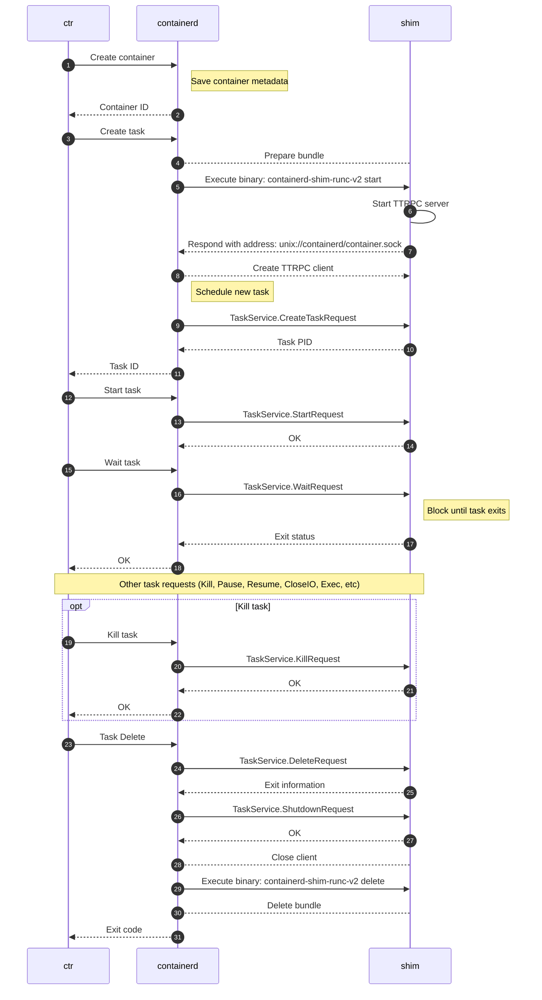
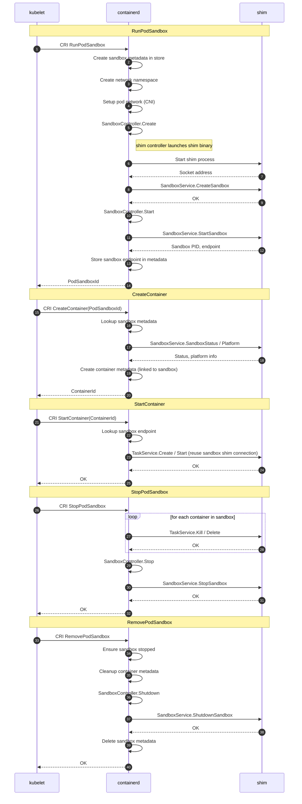
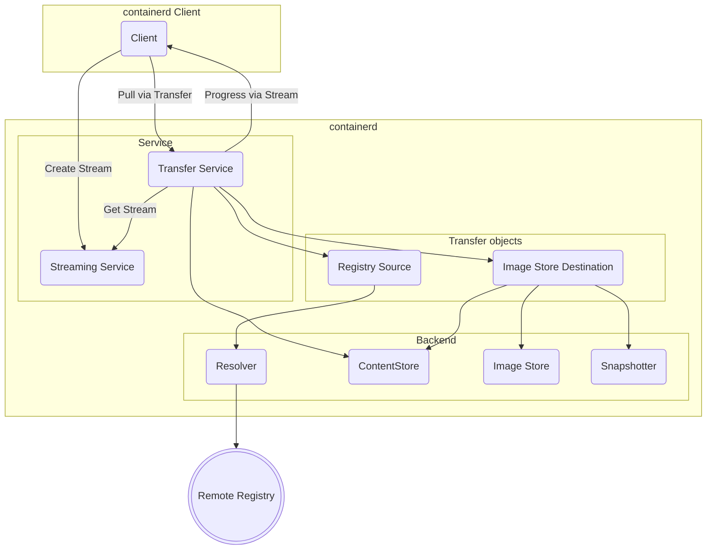

# containerd 架構解析 — 完整圖表資源

---

## 原始碼內現成可用資源

### 圖片（PNG）

| 檔案 | 內容 | 用途建議 |
|------|------|---------|
| `docs/historical/design/architecture.png` | 官方整體架構圖（舊版但概念不變） | 簡報封面或 Introduction |
| `docs/historical/design/data-flow.png` | Bundle 建立資料流 | Activity Diagram 補充 |
| `docs/historical/design/snapshot_model.png` | Snapshot Active/Committed 狀態圖 | Snapshot 說明 |
| `docs/cri/architecture.png` | CRI plugin 架構圖 | Kubernetes 整合說明 |
| `docs/cri/cri.png` | CRI 介面示意圖 | CRI 章節 |
| `docs/historical/cri/containerd.png` | containerd + k8s 整合舊圖 | 歷史對比 |

### 官方 Mermaid 圖（直接可貼）

原始碼 `docs/` 目錄下有 3 個現成 Mermaid 區塊，**經過 containerd 官方維護，完全正確**。

---

## 官方圖 1 — `docs/runtime-v2.md`

**Sequence Diagram：ctr run 完整生命週期（含 Kill + Delete）**

> 這是 containerd 官方寫的，說明 containerd ↔ shim 之間的 ttRPC 完整呼叫順序。
> 這張圖最適合用來說明「Shim 的角色」。



**說明重點：**
- containerd 和 shim 之間全部走 **ttRPC over unix socket**，不是直接函式呼叫
- Shim 的 socket 地址在啟動後才回傳給 containerd（動態發現）
- Delete 階段：containerd 先送 `ShutdownRequest`，再 `exec` shim binary 的 `delete` subcommand 做清理
- `Wait` 是 block 呼叫，shim 在容器 process 退出前不會回應

---

## 官方圖 2 — `docs/sandbox-api.md`

**Sequence Diagram：Kubernetes Pod 完整生命週期（Sandbox API）**

> 說明 kubelet 透過 CRI 建立 Pod 的完整流程，展示 Sandbox 概念。



**說明重點：**
- Sandbox（Pod）先於 Container 啟動，shim 在 RunPodSandbox 時就已啟動
- 同一個 Pod 的所有 container 共用**同一個 shim 連線**（reuse sandbox shim connection）
- CNI 網路設定在 RunPodSandbox 階段完成，不是 CreateContainer
- 四個階段順序：RunPodSandbox → CreateContainer → StartContainer → StopPodSandbox

---

## 官方圖 3 — `docs/transfer.md`

**Flowchart：Image Pull/Push 資料流（Transfer Service）**

> 說明 image pull 時各元件的資料流向。



**說明重點：**
- Client 只跟 Transfer Service 說話，不直接碰 ContentStore 或 Snapshotter
- Transfer Service 分出兩個物件：Registry Source（負責從 registry 拉）和 Image Store Destination（負責存）
- Streaming Service 負責進度回報（progress callback），與傳輸邏輯分離
- 最終由 Image Store Destination 同時更新 ContentStore、ImageStore、Snapshotter 三個後端

---

## 修訂後的 Class Diagram（含所有修正）

> 修正三點：
> 1. Snapshot parent 改為正確的單向關係（only committed as parent）
> 2. 移除虛構的 `Runtime` class，改為正確的 `RuntimeInfo`（Container 的內嵌欄位）
> 3. 加入 `Descriptor` 作為 Image → ContentStore 的橋樑

```mermaid
classDiagram
    direction TB

    class Container {
        +String id
        +String image
        +String snapshotKey
        +String snapshotter
        +String sandboxID
        +RuntimeInfo runtime
        +OCISpec spec
        +note: static metadata only
        +note: stored in bolt DB
    }

    class RuntimeInfo {
        +String name
        +Any options
        +note: name e.g. io.containerd.runc.v2
        +note: → resolves to containerd-shim-runc-v2 binary
    }

    class Image {
        +String name
        +Descriptor target
        +note: name = human-readable ref
        +note: target points to manifest in ContentStore
    }

    class Descriptor {
        +String digest
        +int64 size
        +String mediaType
        +note: digest is SHA256 = ContentStore key
    }

    class ContentStore {
        <<interface>>
        +ReaderAt(descriptor) ReaderAt
        +Writer(ref) Writer
        +Info(digest) Info
        +Delete(digest) error
        +note: SHA256-addressed blob store
        +note: shared across namespaces
    }

    class Snapshotter {
        <<interface>>
        +Prepare(key, parent string) Mount
        +Commit(name, key string)
        +View(key, parent string) Mount
        +Remove(key string)
        +Stat(key string) Info
        +note: does NOT know about Image
        +note: only key and parent strings
    }

    class Snapshot {
        +String name
        +String parent
        +Kind kind
    }

    class Kind {
        <<enumeration>>
        Active
        Committed
        View
    }

    class Mount {
        +String type
        +String source
        +List options
        +note: e.g. overlay lowerdir/upperdir/workdir
    }

    class OCISpec {
        +Process process
        +List~Mount~ mounts
        +List~Namespace~ namespaces
        +Cgroups cgroups
        +note: OCI runtime-spec defines container isolation
    }

    class Task {
        <<interface>>
        +int pid
        +start()
        +kill(signal)
        +wait() ExitStatus
        +delete()
        +note: in-memory only
        +note: represents running process
    }

    class ShimManager {
        +start(id, runtimeName) ShimInstance
        +get(id) ShimInstance
        +delete(id)
        +note: forks shim binary via PATH lookup
    }

    class ShimInstance {
        +String socketAddr
        +int pid
        +note: independent OS process
        +note: IS the container parent process
        +note: survives daemon restart
    }

    %% Container 頂層
    Container --> RuntimeInfo       : runtime (embedded field)
    Container --> OCISpec           : spec (execution config)
    Container --> Image             : image (name reference)
    Container --> Snapshot          : snapshotKey (rootfs)
    Container --> Task              : creates lazily (0..1)

    %% Image → content 鏈
    Image       --> Descriptor      : target (manifest ref)
    Descriptor  --> ContentStore    : digest = key

    %% Snapshot 鏈（修正版）
    Snapshot    --> Kind            : kind
    Snapshot    "many" --> "0..1" Snapshot : parent\n(committed snapshots only,\nbottom layer has no parent)
    Snapshotter --> Snapshot        : manages (by string key)
    Snapshotter --> Mount           : returns mount config

    %% RuntimeInfo → ShimManager（修正版：不是獨立 Runtime class）
    RuntimeInfo --> ShimManager     : name used to resolve binary
    Container   --> ShimManager     : creates task via

    %% Task → Shim 鏈
    Task        --> ShimInstance    : managed by (1:1 or 1:many)
    ShimManager --> ShimInstance    : owns
    ShimInstance --> Task           : exposes via ttRPC
```

---

## 圖表資源總整理

### 可直接使用（官方出品）

| 來源 | 類型 | 說明 | 適合放在 |
|------|------|------|---------|
| `docs/runtime-v2.md` | Sequence | ctr run 完整 + Kill + Delete | 動態：Shim 角色說明 |
| `docs/sandbox-api.md` | Sequence | k8s Pod 四個階段 | 動態：Kubernetes 整合 |
| `docs/transfer.md` | Flowchart | image pull 資料流 | 動態：Image 說明 |
| `docs/historical/design/architecture.png` | PNG | 官方整體架構圖 | 靜態：Component 補充 |
| `docs/historical/design/snapshot_model.png` | PNG | Snapshot 狀態轉換 | 靜態：Snapshot 說明 |
| `docs/cri/architecture.png` | PNG | CRI plugin 架構 | 靜態：Kubernetes 整合 |

### 自行補充（本報告新增）

| 圖 | 類型 | 說明 |
|----|------|------|
| Class Diagram（修訂版，上方） | Class | 靜態物件層級，已修正三個錯誤 |
| Component Diagram | Component | Plugin 架構、Shim 獨立 process |
| Activity Diagram（同學原圖） | Activity | 啟動流程決策，邏輯正確可直接用 |

---

## 三個問題的修正摘要

### 問題 1：`Snapshot --> Snapshot : parent`

**存在且正確**，但 multiplicity 要修正：
- 原圖：`0..1 --> 0..1`（雙向都是可選）
- 正確：`many --> 0..1`（多個 snapshot 可共享同一個 parent）
- parent 只能是 **Committed** snapshot，不能是 Active
- 實作在 `core/snapshots/storage/bolt.go`：parent 是 bolt bucket 的 key，不是物件引用

### 問題 2：為什麼沒有獨立的 `Runtime` class

原同學的圖有 `Runtime` 和 `RuntimeShim` 兩個 class，這是錯的：
- `RuntimeInfo` 是 `Container` struct 的**內嵌欄位**，不是獨立 class
- 它只有兩個欄位：`Name`（binary name）和 `Options`（shim 設定）
- `ShimManager` 讀取 `RuntimeInfo.Name`，透過 `resolveRuntimePath()` 轉成 binary 路徑，fork 出 shim process
- 正確層級：`Container.runtime (RuntimeInfo)` → 告訴 `ShimManager` fork 哪個 binary

### 問題 3：如何分類這些 class

| 分類 | Class | 判斷依據 |
|------|-------|---------|
| **Metadata（靜態，存 bolt DB）** | Container, Image, Snapshot | `core/metadata/` 裡有對應的 CRUD |
| **Content（靜態，存磁碟）** | Descriptor, ContentStore | SHA256 addressed，immutable |
| **介面（可替換後端）** | Snapshotter, ContentStore | `<<interface>>`，有多個實作 |
| **執行期物件（in-memory）** | Task, ShimInstance | daemon 重啟後從 shim socket 重建 |
| **設定型別（embedded）** | RuntimeInfo, OCISpec, Mount | Container 的組成部分，不獨立存在 |

