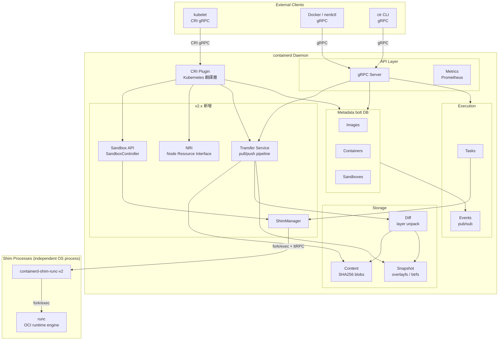
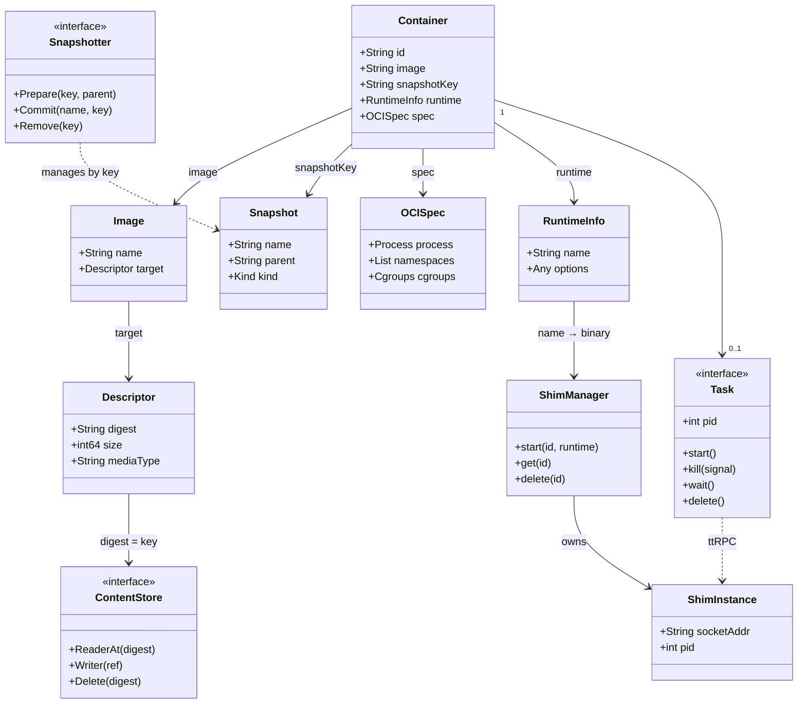
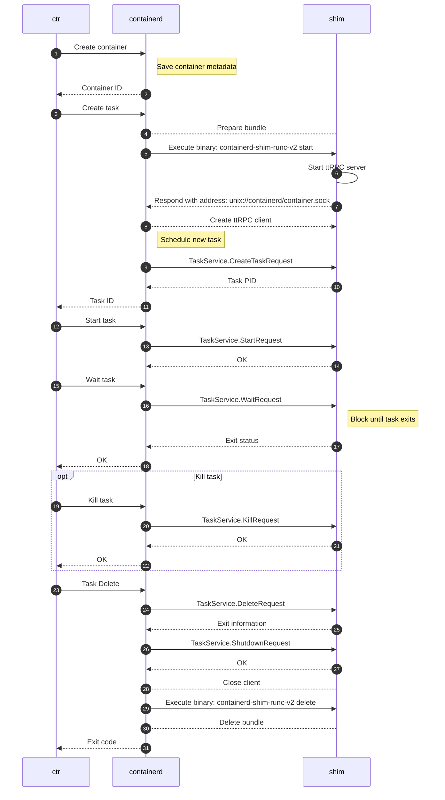
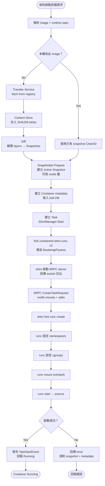

# containerd 現代架構圖 — 簡報用

> 對應版本：containerd v2.x（2024）
> 舊圖來源：docs/historical/design/architecture.png（2017, v1.0 概念）

---

## 哪種圖用在哪裡

| 圖種 | 看什麼 | 適合放在簡報哪裡 |
|------|--------|----------------|
| Component Diagram | 模組與模組之間的靜態連線 | 架構概論、整體介紹 |
| Class Diagram | 物件的欄位與關係 | 靜態結構說明 |
| Sequence Diagram | 誰在什麼時間點跟誰說話 | 動態行為、流程說明 |
| Activity Diagram | 流程決策與分支 | 啟動流程說明 |

---

## 圖一：Component Diagram（現代版架構概論）

> 對應舊圖 architecture.png，加入 v2.x 新增元件



---

### 簡報說明文字（Component Diagram）

**標題**：containerd v2 核心架構

```
API Layer（對外介面）
  gRPC Server  — 唯一入口：Docker / Kubernetes / ctr 統一由此進入
  Metrics      — Prometheus 監控，與業務邏輯完全分離

Metadata（bolt DB，狀態管理）
  Images     — image name → digest 對照表
  Containers — 容器靜態定義，不是 process
  Sandboxes  — v2.x 新增，管理 Pod sandbox 狀態

Storage（不可變資料）
  Content  — SHA256 addressed，所有 bytes 的終點
  Snapshot — Container rootfs，overlay 疊加層
  Diff     — 把 Content 的 tar 解壓進 Snapshot

Execution（執行層）
  Tasks   — 執行中的 container process
  Events  — Pub/Sub，非同步狀態通知

v2.x 新增元件
  Transfer Service — 統一 pull/push pipeline，取代散落的 client 端邏輯
  Sandbox API      — 抽象化 Pod sandbox，支援 VM-based runtime（Kata）
  NRI              — 外部 plugin 介入容器生命週期
  ShimManager      — 管理獨立 shim process 的生命週期

Shim（獨立 OS Process）
  containerd-shim-runc-v2 — container 的 parent process，daemon 重啟後仍存活
  runc                    — OCI runtime，建立 namespace/cgroup，execve container
```

---

## 圖二：Class Diagram（靜態物件關係）

> 說明「容器啟動所需的所有物件是什麼、彼此關係如何」



---

### 簡報說明文字（Class Diagram）

**標題**：containerd 靜態物件層級

```
Container（頂層）
  純 metadata，存 bolt DB，不等於執行中的程序
  ├── Image       — name 字串引用，指向 manifest
  │   └── Descriptor → ContentStore（SHA256 = key）
  ├── Snapshot    — rootfs 的可寫層，parent 鏈是 image layers
  │   Snapshotter — 管理快照，完全不知道 Image 存在
  ├── OCISpec     — 傳給 runc 的 config.json
  ├── RuntimeInfo — io.containerd.runc.v2 → binary 名稱
  └── Task（0..1）— 執行中的 process，lazy created
      ShimManager → ShimInstance（獨立 OS process）
      Task ..> ShimInstance（虛線：ttRPC call，非物件持有）
```

**三個關鍵設計點**
- Container ≠ Task：Container 是食譜，Task 才是真正開火
- Snapshotter 不認識 Image：解耦讓 storage 後端可替換
- ShimInstance 是獨立 process：daemon crash 容器不死

---

## 圖三：Sequence Diagram（容器啟動動態流程）

> 官方原版，來自 docs/runtime-v2.md



---

### 簡報說明文字（Sequence Diagram）

**標題**：容器啟動的完整通訊流程

```
兩個重點：

1. containerd 和 shim 之間全部走 ttRPC over unix socket
   不是直接函式呼叫，是結構化 RPC
   → 這讓 shim 可以是獨立 process

2. shim 的啟動協定（Bootstrap Protocol）
   containerd fork/exec shim binary
   → 傳送 BootstrapParams（stdin）
   → shim 回傳 socket 位址（stdout）
   → containerd 建立 ttRPC client
   之後所有操作都透過這條 socket

Container 的完整生命週期：
  Create（metadata only）
  → Create Task（fork shim → fork runc → paused process）
  → Start（runc start → process running）
  → Wait（block 直到 exit）
  → Delete（cleanup shim + bundle）
```

---

## 圖四：Activity Diagram（啟動流程決策）



---

### 簡報說明文字（Activity Diagram）

**標題**：containerd 啟動容器的完整流程

```
兩條路徑：
  image 已在本機 → 直接用現有 snapshot
  image 不存在   → Transfer Service 拉取
                  → Content Store 存 bytes
                  → Diff 解壓成 Snapshots

固定流程（不論哪條路）：
  Snapshotter.Prepare → 加上可寫層
  建立 Container metadata → bolt DB
  ShimManager.Start → fork shim binary
  shim → fork runc → 設定隔離環境 → execve

containerd 的角色：
  不直接執行容器，而是協調每一步
  每一步都有對應的 plugin 負責
```

---

## 舊圖 vs 現代版差異對照

| 元件 | 舊圖（2017, v1.0） | 現代（v2.x） |
|------|--------------------|------------|
| Runtimes | 一個黑盒方塊 | 拆成 ShimManager + ShimInstance + runc 三層 |
| Shim | 存在但耦合 daemon | 獨立 OS process，daemon 重啟不影響容器 |
| Sandbox | 不存在 | Sandbox API，SandboxController 介面 |
| Image pull | client 端自組流程 | Transfer Service 統一 pipeline |
| NRI | 不存在 | Node Resource Interface，外部 plugin 介入 |
| Runtime v1 | 存在 | v2.0 完全移除，只剩 Runtime v2 |
| CRI | 外部（cri-containerd 專案） | 內建 plugin，預設啟用 |

---

## 三張圖的說明順序建議

```
1. Component Diagram  → 先建立全局觀：這個系統有哪些模組
2. Class Diagram      → 靜態細節：每個模組裡的物件是什麼
3. Sequence Diagram   → 動態行為：實際運作時誰跟誰說話
4. Activity Diagram   → 流程補充：決策分支和完整步驟
```
