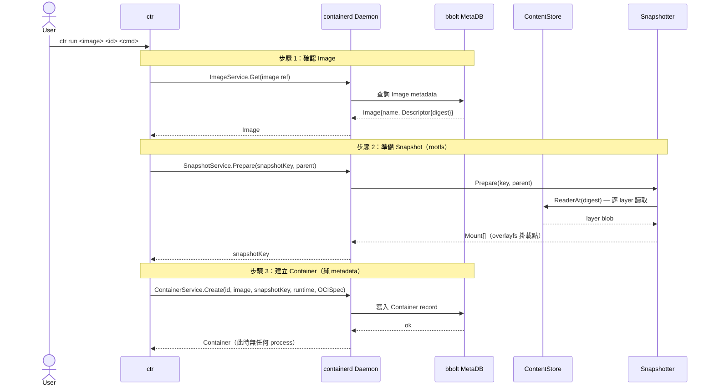
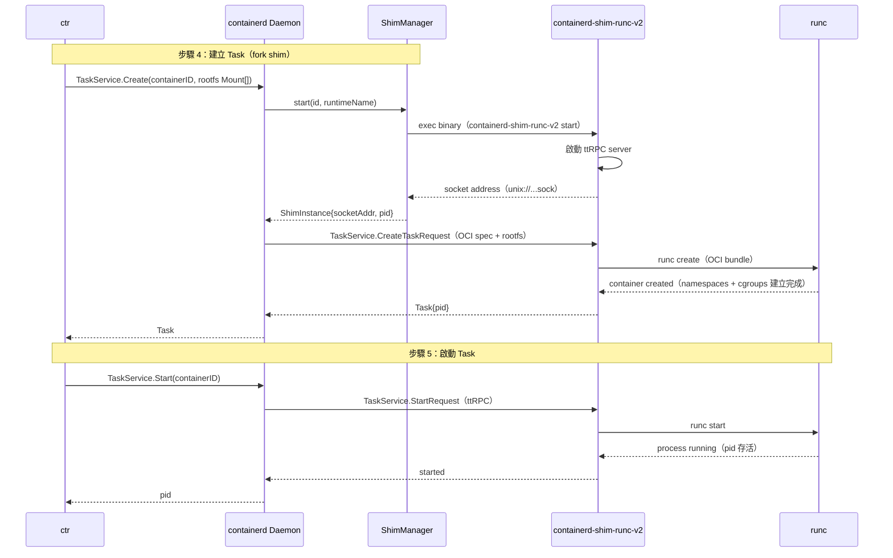
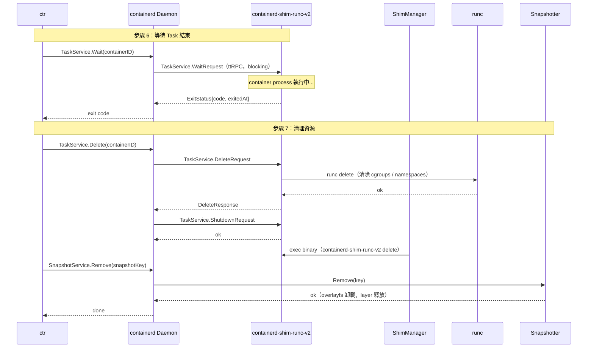

# ctr run Sequence Diagram — 分段版

> 完整流程分三段：準備、執行、清理
> 對應 class diagram 的動態視角

---

## 整體流程概覽

```
[圖一] 準備階段  →  [圖二] 執行階段  →  [圖三] 清理階段
  步驟 1~3              步驟 4~5              步驟 6~7
  Image / Snapshot      ShimManager / runc    Wait / Delete
  / Container 建立       Task 啟動             資源回收
```

---

## 圖一：準備階段（步驟 1~3）

> Image 確認 → Snapshot 建立 rootfs → Container metadata 寫入



### 簡報說明文字

**準備階段做了什麼？**

- Image 不是「檔案」，是一筆 metadata，真正的 blob 在 ContentStore 裡，用 SHA256 digest 當 key
- Snapshotter 把每一層 layer 解開，用 overlayfs 疊成一個 rootfs，回傳 mount 路徑
- Container 建完只是 bolt DB 裡的一筆記錄，沒有任何 process 存在
- 這三步都是「靜態準備」，還沒有任何東西跑起來

---

## 圖二：執行階段（步驟 4~5）

> ShimManager fork shim binary → shim 啟動 ttRPC → runc 建立並啟動容器



### 簡報說明文字

**執行階段的關鍵設計：三層隔離**

- **ShimManager** 透過 PATH 找到 shim binary（`io.containerd.runc.v2` → `containerd-shim-runc-v2`），fork 出獨立 OS process
- **Shim** 是 containerd 與 runc 之間的橋接層，啟動後開 ttRPC server，等 containerd 來連
- **runc** 執行完 `create` 就退出（short-lived），namespaces / cgroups 已建立，container process 由 shim 維持
- 所有 Task 方法（start / kill / wait）都是 containerd → shim 的 ttRPC call，不是直接操作 runc

---

## 圖三：清理階段（步驟 6~7）

> Wait 等待結束 → 反向清理 Task、Shim、Snapshot



### 簡報說明文字

**清理階段：反向拆解**

- `Wait` 是 blocking call，containerd 透過 ttRPC 等 shim 回傳 exit event，不是 polling
- `Delete` 順序嚴格：先刪 Task（runc delete 清 cgroups）→ Shutdown shim ttRPC → shim binary delete → 移除 Snapshot
- Snapshot 最後才移除，確保 runc 清理完成前 rootfs 還掛著
- 若 daemon 在 Wait 期間 crash，container 仍繼續跑（ShimInstance 獨立於 daemon），重啟後可 re-attach

---

## 版本紀錄

| 版本 | 說明 |
|------|------|
| V1 | 完整單張版（字太小） |
| V2（本檔） | 分三段版，準備 / 執行 / 清理 |
