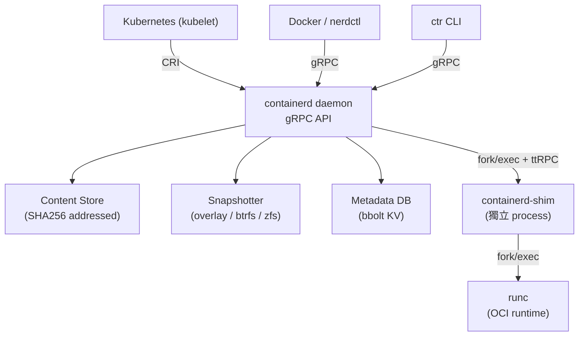

# 架構解析 — 3 分鐘簡報稿

> 接在 Introduction（main function / core idea）之後說
> 3 分鐘 ≈ 3 張投影片，每張約 60 秒

---

## Slide 1 — 「誰在呼叫誰」（靜態架構）

**投影片標題：Architecture Overview**

**圖（放這張）：**



**口說重點（30 秒）：**

> containerd 只做一件事：管理容器生命週期。
> 上層是 Kubernetes 或 Docker 透過標準 API 呼叫它，
> 下層它再呼叫 runc 真正執行容器。
> 中間有三塊核心儲存：Content Store 存 image、Snapshotter 管檔案系統、Metadata DB 存狀態。

---

## Slide 2 — 「為什麼 Shim 獨立存在」（關鍵設計決策）

**投影片標題：Key Design — Shim as Independent Process**

**圖（放這張）：**

```
舊 Docker：

  dockerd ——parent——→ container
  ↓ crash
  所有容器 SIGHUP，全死

containerd：

  containerd ——fork/exec——→ shim ——fork/exec——→ runc ——→ container
                                     ↑
                              container 的 parent 是 shim
                              不是 containerd daemon

  containerd crash → shim 繼續活著 → container 繼續跑
  containerd restart → 重連已有的 shim socket → 無縫恢復
```

**口說重點（45 秒）：**

> 這是 containerd 最重要的設計決策之一。
> 在 Docker 裡，daemon 是所有容器的 parent process，daemon 掛掉容器就全死。
> containerd 的做法是：每次啟動容器，先 fork 出一個 shim process，
> 讓 shim 當 container 的 parent，containerd 只透過 socket 和 shim 溝通。
> 這樣 daemon 重啟或升級時，容器完全不受影響。
> 這就是前面提到的「Fault Design」在架構層的具體實作。

---

## Slide 3 — 「插件化如何解耦」（問題解法）

**投影片標題：Plugin System — Solving Tight Coupling**

**表格（放這個）：**

| 舊問題 | containerd 解法 |
|--------|----------------|
| Storage 後端鎖死 overlayfs | Snapshotter 介面：可換 btrfs / zfs / erofs |
| Runtime 鎖死 runc | ttRPC TaskService 介面：可換 Kata / gVisor |
| Kubernetes 要繞過 Docker | CRI plugin 直接對接，少一層 dockershim |

**圖（放這張）：**

```
Plugin 機制：

  每個模組透過 init() 向 registry 登記
  → daemon 啟動時 topological sort，依依賴順序初始化

  換 storage 只換 Snapshotter 實作，不動 image 邏輯
  換 runtime 只換 shim binary，不動 containerd 任何代碼
```

**口說重點（45 秒）：**

> containerd 整個系統建立在插件架構上。
> 每個功能模組都只暴露一個介面，實作可以替換。
> 比如 storage 後端：預設是 overlayfs，但只要實作 Snapshotter 介面，
> 就可以換成 btrfs 或 zfs，完全不影響上層的 image pull 邏輯。
> Runtime 也一樣，只要 shim binary 實作 ttRPC TaskService，
> 就可以替換成 Kata Containers（VM-based）或 gVisor（sandbox）。
> 這就是為什麼 Kubernetes 能直接接 containerd，
> 少掉了原本的 dockershim 那一層。

---

## 時間分配

| Slide | 內容 | 時間 |
|-------|------|------|
| 1 | 靜態架構圖：誰呼叫誰 | 30 秒 |
| 2 | Shim 設計：為什麼 daemon crash 容器不死 | 45 秒 |
| 3 | Plugin 系統：三個問題的解法 | 45 秒 |
| 收尾 | 一句話總結 | 20 秒 |
| 緩衝 | — | 20 秒 |
| **合計** | | **~3 分鐘** |

---

## 收尾一句話

> **containerd 的架構核心是「三層解耦」：**
> **API 層 → 不綁定客戶端；Snapshotter → 不綁定 storage；Shim → 不綁定 runtime。**
> **每一層都能獨立替換，這就是它能成為整個雲原生生態標準底層的原因。**

---

## 銜接上下文提示

- **接在誰之後**：Introduction 說完「core idea：極致模組化 + 故障設計」之後，你的部分是「那它的架構具體怎麼長」
- **交棒給誰**：說完 Slide 3 之後，下一位應該接「How to install / configure / use」

---

## 備用問答

**Q：為什麼用 ttRPC 不用 gRPC 跟 shim 溝通？**
> ttRPC 是 containerd 自己做的輕量 RPC，移除了 HTTP/2 overhead。
> shim 跑在本機，不需要 HTTP/2 的多路複用，用 unix socket 直連更快。

**Q：Snapshotter 和 Docker graphdriver 差在哪？**
> graphdriver 知道 image、layer、tar 格式，邏輯耦合很重。
> Snapshotter 只懂「Prepare 一個可寫目錄」和「Commit 成唯讀快照」，
> 完全不知道上面是 image 還是 container，職責更單一。
